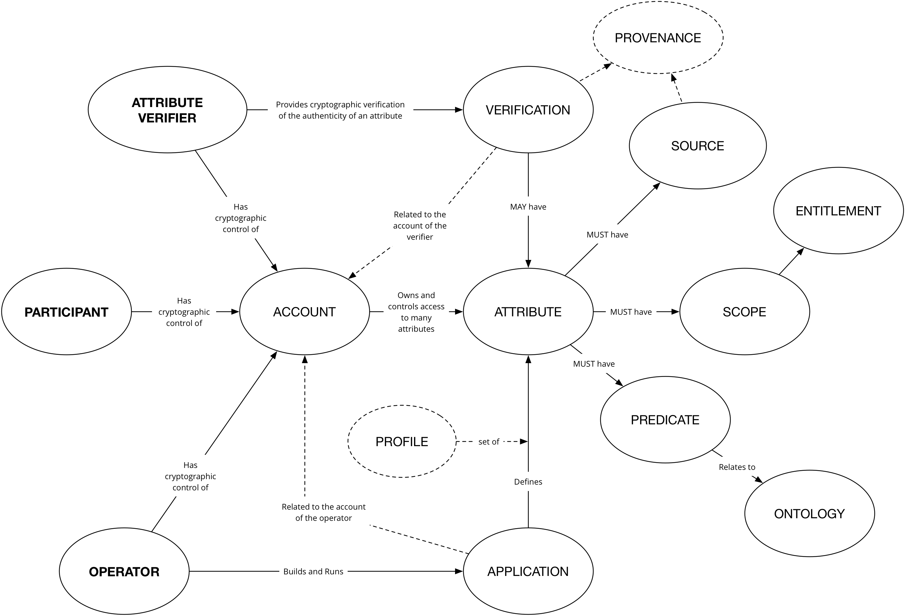
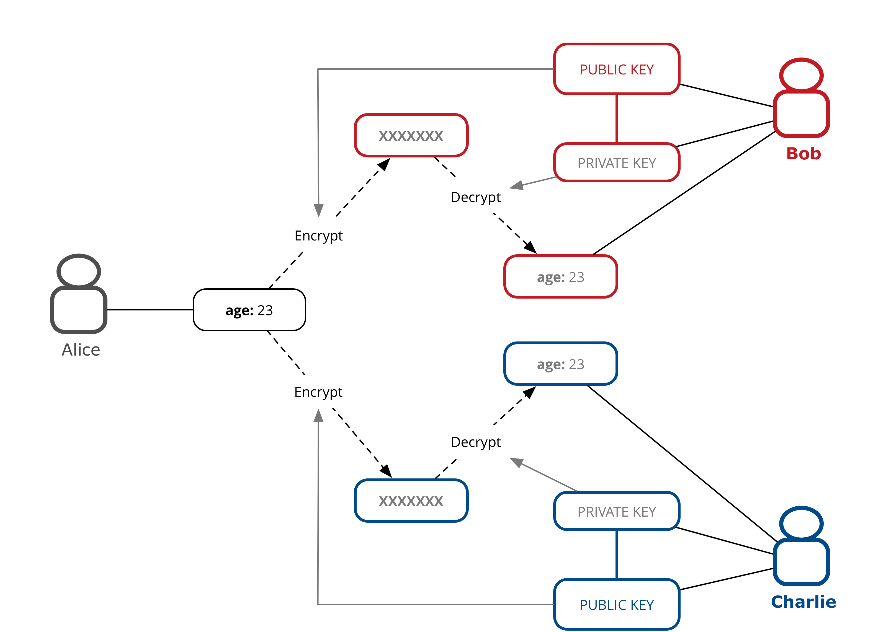
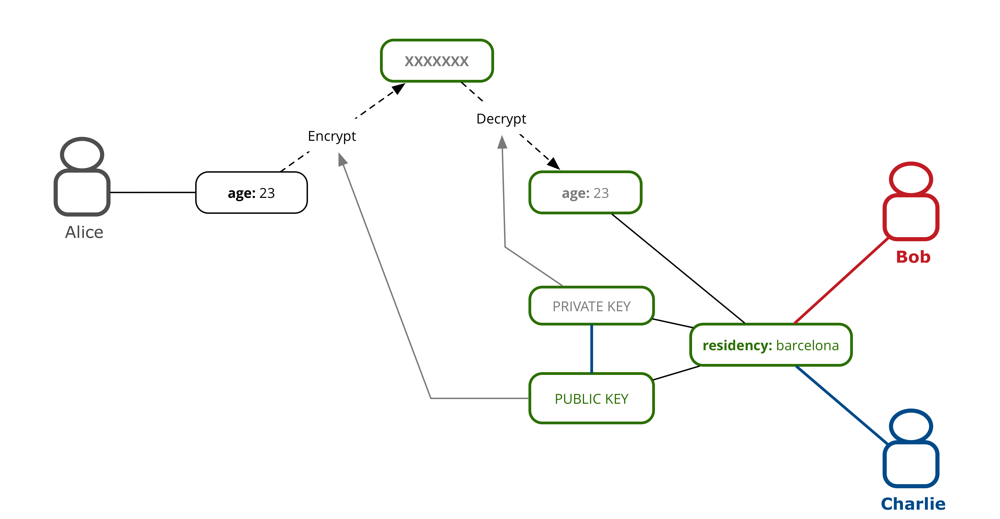

# Conceptual Framework

This section describes the foundational concepts that are combined to achieve the purpose of DECODE. 

Entities

- users (citizens)
- governments (cities)
- businesses (SMEs)

We broaden the scope to resources: data, but also devices. Resources are either *public* or *restricted*. (Some data is personal data, other data is not. The architecture cannot and does not distinguish that at the architecture layer.) Restricted data is *encrypted*. All data is stored on a p2p, high availability, redundant data store.

The *publisher* of restricted data determines who has access to the data. To this end it attaches an *entitlement condition* to the restricted data. Users wishing to obtain access to the data need to prove they possess the necessary *entitlement*. Entitlements can be *issued* to users. Entitlements have a *lifetime*: they are not valid before and not valid after a certain time. Additional flexibility can be expressed through *smart contracts* that, given a set of inputs (consisting of entitlements but also other *context*, like the current location or the current time or date) yield an entitlement. Smart contracts are stored and executed on a *distributed ledger*. Users store[^store] their entitlements privately.




```comment
tomd: here we need to refine.. entitlements are possibly dynamic, as mentioned in the footnote; also, currently it is not clear that we will execute the contracts 'on the ledger', or just use the ledger as a means of verifiation -- this is mentioned below, as well
jimb: given chainspace it is precisely not executing transactions on the ledger.
jimb: also we need to work on some of the terminology - especially around restricted and personal - should we use an existing ontology?
```
[^store]: Maybe entitlements do not even exist when not needed or used, and only come into being when needed.


(So, for example, a home owner wishing to allow his guests access to the local Wifi could create an entitlement `john-doe-house-wifi`, a smart contract saying "*if someone has an entitlement `renting-john-doe-house` and this entitlement is valid now, then output the entitlement `john-doe-house-wifi` valid for one hour*". Then if the owner rents out his house and issues the renter the entitlement `renting-john-doe-house`, access to the wifi is securely arranged automatically.)

Data sources[^datasources]:

- "Streaming" data from sensors
- open government data
- user generated content (blogs, recommendations, observations)
- personal attributes & usage data
- ...

[^datasources]: Not sure whether we need the distinction, although streaming sensor data seems to be a special kind of data that we need to reckon with. (JHH)


## Privacy by design

```comment
PAULUS
```


**General Data Protection Regulation**

https://en.wikipedia.org/wiki/General_Data_Protection_Regulation

- Note that a software component / product cannot "implement" or be "compliant with" GDPR as compliance is a combination of both software and human systems and processes.
- Software can however enable or hinder an organisation in achieving GDPR compliance
- As DECODE is designed with privacy in mind from the ground up it naturally affords a good foundation
- Further, many of the privacy by design principles will correlate with needs of GDPR compliance, for example right to be forgotten
- Finally DECODE will provide transparency for **participants** about exactly where their data is and with whom it has been shared which will also enable GDPR compliance
- See DECODE as a tool that will help your organisation, not as a whole solution to GDPR. 
-

## Attributes 
```comment
TOM D
```

### Identity

Identity within DECODE inverts the current world position whereby participants know little about the operators of the services they are registered with but the services know everything about the identity of the participants. "Vendor relationship management" so to speak; where the vendors are DECODE-enabled applications.
In DECODE, the focus is on strengthening the position of the participant in terms if understanding exactly what organisations are operating applications and what those applications are doing with the participants' data.

**Participants**
The identity of the participants is irrelevant to the DECODE system, and also to the applications that run in the DECODE ecosystem. What is relevant are the attributes that are related to the participants. We would go as far as to say that identity is a concept not needed at all. In the real world we live and act in many different contexts, these activities and the relations in those contexts each define a perspective on who we "really" are. There is overlap, sure, but there is no context in which **all** aspects of us are relevant. So, what is our identity? 

There are three options: 

1. identity is what **we** think **we** are (i.e. self)
2. It is how the state defines us, typically through a number or code assigned at birth
3. It is the combination of all perspectives from all contexts combined

In the DECODE ecosystem we will keep the diverse and subtle ways of addressing aspects of our lives and selves in different (online, digital) contexts, and leverage the capacity of the medium to improve upon this in a privacy enhancing fashion. When thinking of identity in this ecosystem, option one, above, is irrelevant, and option three is fine in an abstract way, but fraught with privacy issues when it would be possible to address & use practically. That leaves the extremely narrow definition of the government assigned civic number. Apart from the issue that people exist without such numbers, this is just a single attribute of a person, at best a strictly formal (or legal) definition of identity, but missing out on just about everything we are. 

Better to avoid discussion and confusion and **not** to use the word identity at all, and talk about different collections of attributes, relevant in different (online, or even DECODE-supported offline) contexts (or *applications*). 

Let's call such a collection a **profile** for now.

In the end we are talking about physical people (AI's with civil rights are a ways off), even when assigning attributes that are purely abstract, or are transferable, these are about, or related to a person. This person is represented in the DECODE ecosystem as a profile, but **not uniquely**. One physical person will have control of the data related to multiple **profile**. These may overlap (in the values of certain attributes), or may not. 

These profiles aren't entities in the DECODE system, they are a way of talking about *application-defined* collections of attributes. Profiles are the subject of **entitlements**, even when, for instance, the only attribute needed for the online alcohol-buying app is the age, that app would, in its use, **define** a profile with an age, and nothing else at all. For the sake of argument we leave out practicalities as payment, and the address to send the purchase to.

The connection to the real person in the real world is through a DECODE account that the person will authenticate against in order to interact with DECODE applications. This account is not part of the decode data that these applications have anything to do with, although the authentication app or apps (multiple means of authentication) could be seen as a special kind of DECODE enabled applications.

Authentication usually involves a participant providing various personally identifying facts to a system such as date of birth, passport id / driving licence number, potentially with additional offline checks and questions of the participant. For example in signing up to the UK's [gov.uk/Verify](https://www.gov.uk/government/publications/introducing-govuk-verify/introducing-govuk-verify) you register with a federated identity provider (e.g. The Post Office). The post office has a mobile app that can capture images of your passport, OCR the details and confirm them against the HMPO (Her Majesty's Passport office) and then takes a photo using the phone camera in order to compare against the photo on the passport.

A participant demonstrates control of these **attributes** through some cryptographic means (essentially by holding a private key). This private key may be embedded on a physical device that the participant owns, such as a [Ubikey](https://www.yubico.com/products/yubikey-hardware/) or Smart Card issued by a civic authority. In the case of a device issued by an authority it may also contain attributes of interest to other DECODE applications, such as the fact that one lives in a particular city. These attributes, when stored, record the provenance and the semantic meaning of the relation in their urn, and can so be "officially verified" attributes that certain applications may require (such as voting in participatory budgeting applications, see below).

```comment
jimb: How does ABC now fit in with the conceptual model of attribute verification and provenance
```


### Attribute Provenance
```comment
Curator: TOM D
```

#### Accountability of systems

Of course digital systems cannot be held accountable in any legal sense (yet), but we'll need to address the fact that consequences of using digital and 'autonomous' systems are no longer as precooked as they once were.
No longer is it guaranteed that the mechanisms and processes though which technology interacts with the world are clear and understandable, even to the engineers who build the systems; the bias in the training data is invisibly and irretreivably encoded in the trained models.
This means that technology needs to be able to be held accountable in itself, not only through the people running it or the engineers building it. 
In order to enable this, accountability needs to be designed into the sytems, needs to be part of the systems, and thus, in a certain sense, systems need to be able to reflect on their actions; at least in response to queries.

#### Data transparency

Taking stock of this *accountability design* challenge leads us to a couple of preconditions to a possible solution or implementation. One of the most important of these, especially in a DECODE context, is **data transparency**. What type of data was used, where, when and for what purpose was this data collected? 
In a system for data management (such as DECODE) the relevant metadata needs to be recorded and made available when needed, either directly to the user in response to queries, or to aggregation alghoritms that produce data that itself needs to be able to provide an account of its provenance. The accountability mechanisms may not be part of DECODE, the data formats needed to make them possible **are**.

In DECODE the provenance metadata is provided through the *application*. When a participant stores some data in a DECODE-enabled system, the participant **always** does this through an *application* like GebiedOnline or Decidim. Similarly, the application may generate data on behalf of the participant (Making Sense) and store it (or a link to it) through DECODE api's. The data recorded or stored always has this 'tag' that it comes from this particular *application*. Of course, in addition to the provanance metadata, much more may be stored, related to its type, lifetime etc.

#### Provenance

Data in the DECODE core is stored as **attributes**. Attributes are **statements** of the form **\<subject> \<predicate> \<object>**. The subject represents the participant, the oject the 'value' (data), and the predicate defines the type of the relation between the subject and the object. 
In the predicate we encode the provenance. An example:

    <account> addressLocality 'Amsterdam'

The representation of \<account> in the system is possibly just a public key that I control the private key of; 'Amsterdam' is the value of the attribute, and 'addressLocality' is what the attribute represents.
What is interesting is the question: *who made this claim*?? Also, what does it mean, *addressLocality*? This is the information that you want to record together with with the attribute statement itself. 
Typically, you encode the answers to both questions in the predicate clause. To start with the last question, what does 'addressLocality' mean, you solve that like this:

    <account> schema:addressLocality 'Amsterdam'

Where 'schema' is defined to mean http://schema.org/. The total predicate so becomes a urn (which in this case you can even click on for a html version) that defines this particular predicate: http://schema.org/addressLocality. 

So far this is standard semantic web. It becomes more DECODE specific when we want talk **about the statement**, when we want to record who makes this claim, when we want be able to verify the statement, and possibly to validate the value.

To enable this functionality we add a fourth clause to the statement:

    <account> schema:addressLocality 'Amsterdam' <app_id:scope:verifier>

```comment
jimb: I think we might need to distinguishe more clearly between the conceptual model here and the actual implementation. there is a slight issue I think with talking about clauses and statements in that it sounds like I would expect to see this representation somewhere in the system. we may visualise it in the UI but it feels to me like this structure is more logical than implementation?
```
At the very least the \<prov> clause holds an **application id**; the other parts of the clause are optional. The app_id is a unique id that represents an **application**, and is issued what that application registers (for the precise sense in which we use the word application, please see the glossary).
All statements are made by an application. Without anything else, this application is the only entity that can access the data (applications always have access to their own data); default **scope** is 'application'. Another scope is 'world'; further scopes are entitlements based on (possibly unrelated) attributes (only people of Amsterdam can see that I live in Amsterdam). There is also a 'decode core' application hat does not play by these rules. This would be an application that allows participant to 'administer' their decode 'accounts' and data. Participants that control an \<account> can, through this application, always access (and delete, but not necessarily modify) the statements that have this \<account> as a subject.

The *verifier*, lastly, is a participant, operator or a group of these that can vouch for the statement in a precise and formal way. In the above case that could be the City of Amsterdam, for a formal and legal claim, or it could be 15 people of Amsterdam that form a quorum to vouch that I, illegal immigrant of Amsterdam *do* indeed live there (as is a requirement of gebied online, for instance).
The implementation, through digital signing and attribute based cryptography is described elsewhere. The 'verifier' field of the provenace clause holds enough information to verify that the claim is made by the verifier and not altered after signing.


Conceptual overview of why provenance is important

### Attribute verification with ABC
```comment
PAULUS
```

DECODE will **not** provide the role of **identity verification**, however it will provide an integration protocol to allow **claims** made by participants to be leveraged in DECODE interactions (specifically, smart rules). These claims may lead to **entitlements**.

A core functionality of DECODE is **verification** of **claims** that an individual makes about themselves. For example "I live at 00 Xxxxx Xxxxxx" or "I am over the age of 18" or "I am a resident of Barcelona city". These claims may be important in a particular application use case. For example if we have an application which allows voting to residents of Barcelona, we might want to be able to verify that the profile as defined by the voting application is also a resident of Barcelona. Furthermore, the application defines a secure and uniquely identifiable attribute, together with a smart rule that only allows a single vote for any particular ballot. Through using DECODE, the attribute does not have to expose any real knowledge (for example a citizen ID number) but it must be possible to be checked for a particular value (number of votes cast).

So how are claims actually verified in the first place? In the example, the entity responsibile for verification would be the city of Barcelona. This could be a physical process, or could be done online (as in the Dutch DigiD mechanism), and involves some exchange between the city and the individual. The result of this exchange would be a cryptographic token, signed by the city, which, invoked with a specific smart rule would result in an attribute with verified provenance and value being set in the DECODE platform. This attribute would be available for that person to use in any application relying on it.  This whole process could take place through a website which is run by the city of Barcelona (and thus is a DECODE enabled application). Required will be a mechanism by which the DECODE network can **trust** the public key of the city of Barcelona, i.e. there will need to be a registration protocol to establish this trust.

The User Journey for this interaction would involve the person authenticating with their account on this website and then creating a "city_of_residence: Barcelona" attribute signed with the city's private key. In this example there would be a validity time limit on this attribute, a month, perhaps. People move.
Because the choice of using applications that reference this attribute is in the hands of the participant they have strong control of how this link is used. In a p2p sharing application a different proof-of-residency attribute may be good enough, for instance.

In order to make it straighforward for developers to build DECODE applications, the mechanisms for interacting with and validating external or "official" claims will be a core part of the language that is used to express Smart Rules.


## Entitlements
```comment
Curator: Mark D
```
```
tomd: this needs to be rewritten / elaborated, in the current form it does not address the idea of attribute-based dynamic entitlements.
jimb: I'm not sure I understand 'attribute-based dynamic entitlements'
jimb: need to agree our terminology here, subject vs data owner etc

```

We define two parties in any given data exchange, the **data owner** and the **data consumer**. An **entitlement** is an agreement of disclosure controlled by the **data owner**. A **data entitlements**  concerns the sharing of data. In DECODE an **entitlement** is defined in a **policy**  *and* implemented with the application of cryptography.


### Entitlement Policies

The DECODE architecture is inherently distributed and as such the management of entitlement policies will need to respond to some well understood challenges :

**Challenge of embedded decisions** The entitlement policy for a piece of data would need to be consistent wherever that data is stored - the data may be sharded or replicated or both.

**Challenge of lack of overview** Distributed entitlement policies make it difficult to gather and understand policies governing the data.

**Challenge of identity integration** A data entitlement system within the context of a distributed system may need to interface with one of many identity systems.

**Challenge of expression** A formal expression of an entitlement policy should have a rich model of expression.

There are 4 key elements to an entitlement policy :

- What **attributes** are being shared
- With **whom** is the data owner sharing data
- For what **purpose**
- Under what **conditions** will the data consumer use the data (e.g. [https://opendatacommons.org/licenses/pddl/](https://opendatacommons.org/licenses/pddl/))

Rather than attempting to build a hierarchical entitlements system by classifying certain attributes into privacy groups, such as "sensitive, personal, public" DECODE specifies all entitlements at the granularity of individual attributes.


DECODE defines three possible access levels:

| Access level    | Description        |
| --------------- | ------------------ |
| `invisible`     | Subject can see neither the existence of this attribute, or its value           |
| `can-discover`  | Subject can see that the data item has a value for this attribute, but not what it is |
| `can-read`      | Subject can both see that the data item has a value and read that value  |


In most cases, the participants in the system will not be creating the entitlements directly, they will be interacting with DECODE applications. These applications will have the ability to declare what entitlements they require and the participants can agree to them, in much the same way that users can accept authorisation grants using OAuth.

```
markd - I think we should choose one propsed implementation??
```

### Implementation (Access control)

Defining and declaring entitlements is a matter of describing access rules. In order for these to be useful we require a mechanism to enforce them. In a traditional system we would simply "trust" that the system has been coded to take account of the entitlement declaration - for example we might install an authorisation server product to define and store entitlements and rely on the developers of the system to code appropriate controls into the system that communicate with the authorisation server.

- Data Vault
- Encryption
- Broadcast encryption (e.g. DRM)
- Attribute based encryption


**Principle: Access control should live with the data**

For example if the data has been aggregated into a central store, access should only be provided to that data through an API which has access control embedded within it, and which understands the DECODE entitlement policy.

Other ways that this can be achieved are via encryption where the access control is directly related to the data.





**Controlling access to large datasets or streams of data**

We require a mechanism for controlling access to either large datasets or streams of data. Perhaps I wish to publish a dataset including all my movement data from my phone for the last two months and yet control access to certain attributes.

Options:

- Encrypt each data item in the list as above
- Separate the data into "columns" ie. each data attribute is becomes an array of values and these are then encrypted using ABE
- Investigate DRM tech for encrypting large (e.g. Video) streams can similar approaches be applied to user data?


### Attribute Based Encryption 

```comment
Curator: Paulus
```

Key based encryption which is based on attributes about the participants - for example a key is created based on the fact that a person is a resident of the city of barcelona. The data can be encrypted in such a way that anyone with that attribute in their key can decrypt.


Is one way in which access control can be implemented and can provide a cryptographic relationship between the declaration and the implementation.




### Transparency and Integrity

Alongside controlling access to the data, decode will also ensure that access to data is **audited**. This is made possible by virtue of the fact that in order to interact with decode, a participant will need to be registered. In particular **operators** will need to be registered and have some level of authenticity - for example be traceable to a company registration (e.g. in UK companies house). This allows a far greater level of transparency to both the participants and regulatory authorities (e.g. city council) of what data is being shared where.

Alongside audit trails we also wish to make it clear to the participant exactly what entitlements they have granted in a simple manner. An example of work in this area is https://www.digitalcatapultcentre.org.uk/project/pd-receipt/ who are developing ideas around the user experience of how to represent entitlments a user has granted.


## Authentication

For the purposes of DECODE we define authentication as being the mechanism by which a participant gains access to the system in a controlled way such that only that participant can access and control the DECODE data associated with themselves.  
Password-less Authentication
A core goal of authentication for decode is that we should aim to have authentication without passwords.

Options for the implementation of this include:

-	one time codes sent to a device
-	Device OS security (e.g. fingerprint on a mobile phone or laptop)
-	Embedded authentication in the device, rely upon general OS security such as locking screen on a PC

We also make the observation that in general, security and privacy on the device is not the core purpose of DECODE - of much greater concern is privacy and control of data once it leaves the device and enters the network.

For example, if I gain access to a persons device (e.g. Laptop) there is already enough of a compromise in terms of being able to access all their non DECODE material that it is potentially not worth having a secondary control on the application itself.

This topic requires further investigation, threat modelling and discussion, however we will aim to attempt to only implement password protection as a last resort.

## Distributed Ledgers
```comment
ALBERTO
```


