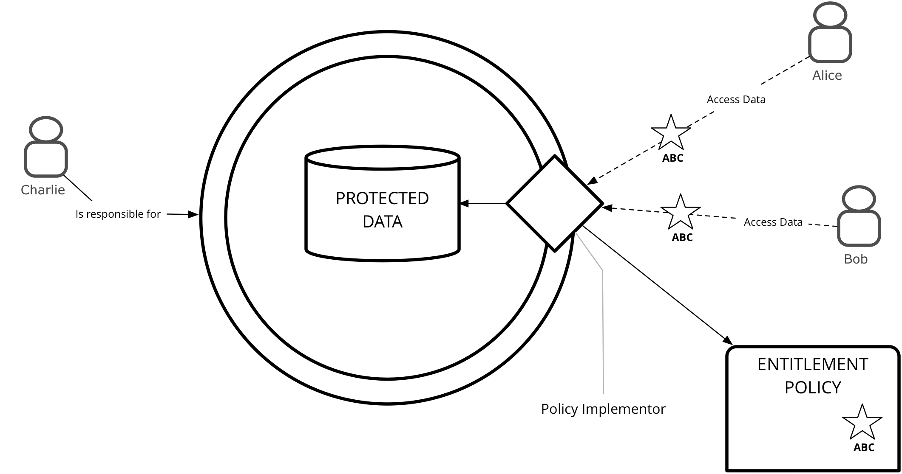

# Conceptual Framework

This section describes the foundational concepts that are combined to achieve the purpose of DECODE.

The conceptual framework of DECODE is built on three foundations:

- A distributed Ledger
- Zero Knowledge proofs 
- Attribute Based Cryptography
- Cryptographically verifiable entitlements
- A highly verifiable and controlled execution environment

The ledger provides a resilient, tamper-resistant (tamper evident?) record which allows cryptographic demonstration of "facts" to be made. For example in the case of participatory democracy, it is possible to cryptographically demonstrate that a set of citizens signed their support for a particular initiative. This significantly increases the value of such an activity in the political world. A comparison would be with an online petition which has only email addresses recorded against it. Without cryptographic evidence there are several problems with this:

- No traceable evidence that these emails belong to the group of citizens involved
- "Leaking" of personal data (the emails) breaking privacy
- No demonstrable evidence that the person who actually controls an email was that who digitally signed the petition

DECODE proposes a scheme whereby not only can citizenship and accountability to an individual be demonstrated cryptographically, it can do so without requiring the proof to contain revealing personal details. This is achieved through the application of Zero Knowledge proofs and Attribute based Cryptography.

DECODE provides for a mechanism of declaring and controlling access to a person's data. We employ combinations of Attribute Based Cryptography and the ledger to record such declarations and provide system mechanisms to control the access. For example it may be that in within a community of individuals the members of the community wish to share data only with their peers. In a traditional setup this would be achieved using standard database and web server technologies. In DECODE we propose a scheme whereby access is provided through cryptographically verifiable credentials (Attribute Based Credentials) and varying levels of mechanism to protect such data, including Attribute Based Encryption. DECODE takes a decentralised approach to the issuing of these credentials, removing the need for a central authority.

We can extend this data sharing capability to datasets for wide sharing - for example we can consider individual contributions to an aggregate dataset. This is often called the Open Data Commons [REF!](to d1.8). 

```comment
jimb: Add some summary from D1.8
```

Each of these conceptual building blocks are explored within the following sections which should provide the basics required to understand how the implementation functions. Each of the topics is a deep area of study in its own right so we provide references to allow further exploration.

A fundamental concept within DECODE is that *all* data is represented by what are naming *Attributes*. Attributes have a particular definition which is described below. This allows us to build a conceptual model of how DECODE fulfils its purpose. 

To describe how data (hereafter *attributes*) is produced and consumed we specify the entities and roles within the DECODE *ecosystem* That is the set of systems, people and organisations that in combination fulfil the purpose of DECODE.

*Real world entities* that play a defined role in the DECODE ecosystem are:

- Individual citizens
- Organisations
    - Public authorities
    - Businesses
    - NGOs

```comment
jimb: How would we classify the organisation of GO or DECIDIM?
```

Within DECODE we define several *roles* that these individuals or organisations play within the ecosystem.

- Participant
- Operator
- Attribute Verifier
- Node Host

*Participants* represent the end consumers of DECODE - in this role an entity is sotring data and interacting with *applications*. *Applications* are *operated* by *operators* who are entities that code and maintain applications that run in the DECODE ecosystem. *Attribute verifiers* are entities which have the ability to *verify claims* associated with a particular *attribute*, and provide  cryptographic evidence of the claim. For example a public authority can verify that a participant is a resident of a particular city or country. *Node hosts* are members of the DECODE ecosystem who operate the underlying infrastructure of the DECODE network. Most commonly they will be hosting and running the nodes within the network, but may also run specialised services such as meta data services or online wallet services. 

All interactions within DECODE are cryptographically linked back to an *Account*. In its most basic form this can be thought of as a public / private key pair. In effect the controller of an account will own a private key and therefore there is some cryptographic evidence that this control can be demonstrated. This is common to all distributed ledger systems. As with these, it makes the security of the private keys a prime concern [REF!](Section on hardware security).

*Applications* within DECODE are subject themselves to a high degree of verification and transparency. Firstly all applications must be transparent about what *attributes* they wish to access / manipulate for a *Participant*. We refer to this set of attributes as a *Profile*. 
 
A key concept to understand about DECODE is that attributes are strongly linked to applications. This provides a level of control and traceability over the system. It says that attributes can only be “created” (or “captured”) by applications and that there is a 1 to 1 relationship between attributes and applications. This means that e.g. even if two applications both capture a First Name, in DECODE these represent separate instances of attributes. 

Data items on there own provide little value, for example the string "Paris" could mean many things to many people. In order to be able to make a useful system that can process data, and in particular provide additional value for the purpose of data privacy and integrity, DECODE implements a conceptual model that attaches other key concepts to an attribute. This model allows us to make claims about attributes. We begin with a basic structure of the form:

ATTRIBUTE = (SUBJECT PREDICATE OBJECT)

Where the SUBJECT is the entity to which the attribute relates (in DECODE terms, the account), the PREDICATE describes the relationship between the  SUBJECT and the OBJECT and the OBJECT being the value of the attribute.

Thus we might say (say in JSON):

locality : ["decode-account:543232", “schema:addressLocality", "Paris"]
    ^                  ^                        ^                  ^
    |                  |                        |                  |
ATTRIBUTE           SUBJECT                 PREDICATE           OBJECT


where schema and decode-account are URNs (https://www.w3.org/TR/uri-clarification/#urn-namespaces) to http://schema.org/ . How to interpret a decode-account URN is TBD.


This already provides a lot of value. However DECODE adds two further concepts to the model, PROVENANCE and SCOPE…

ATTRIBUTE = (SUBJECT PREDICATE OBJECT PROVENANCE SCOPE)


PROVENANCE provides traceable evidence to support the claim we are making. This evidence currently consists of two parts, the source of the attribute, by which we mean the application which captured it or generated it, and optionally one or more verification elements which are links to a cryptographic demonstration of that attribute. In our example this would be an Attribute Based Credential issued by the city authority of Paris associated with the private key of the account.

SCOPE relates to the agreement that is made between the application and the owner of the attribute (usually the Participant), in terms of entitlement. In DECODE terms, this is a link to an entitlement policy.

```
locality : ["decode-account:543232”,      <— SUBJECT
	    "schema:addressLocality”,     <- PREDICATE
            "Paris”,                      <- OBJECT
            ["application:23234”,         <- source        /           
             "verification:67565”]        <- verification  \PROVENANCE
            "entitlement:8678756”         <- SCOPE
           ]
    ^                
    |               
ATTRIBUTE          
```

application, verification and entitlement are also URNS, TBD how they resolve.

Don’t think we should include this part until we are closer to implementation but the structure in (loosely) BNF (https://tools.ietf.org/html/rfc4234, https://www.w3.org/Notation.html)  for attributes is as follows:

```
/*
1# means 1 or more items in a repeating list, separated by commas
1* means one or more repetitions of the following symbol
*/

ATTRIBUTE = (SUBJECT PREDICATE OBJECT PROVENANCE SCOPE)

SUBJECT = decode_account
PREDICATE = 1#ontology_url
OBJECT = 1*string
PROVENANCE = (source *verification)
SCOPE = entitlement_policy

ontology_url: A deep link to a particular ontology reference, e.g. http://xmlns.com/foaf/spec/#term_Person
string: In a formal definition would be made up of valid characters, omitted here

source: a link back to the DECODE application that originated the attribute

verification: a link to zero or more (making it optional) cryptographic verifications of the attribute, for e.g. an attribute based credential representing residency of “Paris”. Note: the ABC that is linked to may also be used by other attributes.

entitlement_policy: A link to an entitlement policy 
```


Thought - theres a whole part of the proposal around “standards” etc - what if the above formed some form of RFC to define privacy aware attributes? We could at least write it as an RFC and submit it to see what people thought, DECODE would be a reference implementation.


It is mandatory for every *attribute** to be related to both its *provenance* (from where was it derived, namely which application) and also a relationship to an *Ontology* (e.g. [FOAF](http://xmlns.com/foaf/spec/) which describes meta-data about an attribute (type, purpose, scope).  Optionally an attribute can be cryptographically **verified** by an **Attribute Verifier**).

```comment
jimb: clear up the terminology on provenance. 
```

The combination of this meta data about attributes and verification provides a foundation allows us to build higher level constructs such as *Smart Rules* and *User Experience* which make it straightforward for *Application Developers* to produce high integrity, privacy aware *Applications* without needing access to highly specialised experts in the field of cryptography. It allows *Participants* to have a highly transparent view and control of their data also without the necessity to become cryptographic and privacy experts themselves. A key principle of DECODE is "User Friendliness" for both *Application developers* and *participants*


*Participants* generate resources. Resources are either *public* or *restricted*. (Some data is personal data, other data is not. The architecture cannot and does not distinguish that at the architecture layer.) Restricted data is *encrypted*. All data is stored on a p2p, high availability, redundant data store.

The *publisher* of restricted data determines who has access to the data. To this end it attaches an *entitlement condition* to the restricted data. Participants wishing to obtain access to the data need to prove they possess the necessary *entitlement*. Entitlements can be *issued* to participants. Entitlements have a *lifetime*: they are not valid before and not valid after a certain time. Additional flexibility can be expressed through *smart contracts* that, given a set of inputs (consisting of attributes and entitlements but also other *context*, like the current location or the current time or date) yield another entitlement or generate additional data. Smart contracts are defined by *applications* and stored on a *distributed ledger*. Participants store their entitlements privately, insofar as they are not dynamically generated when needed.

A home owner wishing to allow his guests access to the local Wifi, for example, could create an entitlement `john-doe-house-wifi`, a smart contract saying "*if someone has an entitlement `renting-john-doe-house` and this entitlement is valid now, then output the entitlement `john-doe-house-wifi` valid for one hour*". Then if the owner rents out his house and issues the renter the entitlement `renting-john-doe-house`, access to the wifi is securely arranged automatically.


## Privacy by design

```comment
PAULUS

Add reference to D1.2 About PbD:
  The below texts are (mostly) verbatim from that deliverable:
  * '20170630_D1.2_Privacy Design Strategies for the DECODE architecture & Data Management Plan'(.pdf)

  additional sources to be included:
  * [Hoepman, 2014] J-H. Hoepman, Privacy Design Strategies, IFIP TC11 29th Int. Conf. on Information Security (IFIP SEC 2014), pp. 446-459.
  * [Colesky et al., 2016] M. Colesky, J-H. Hoepman, C. Hillen, A critical analysis of Privacy Design Strategies, 2016 IEEE Security and Privacy Workshops, pp. 33-40.
  * https://www.decodeproject.eu/blog/privacy-design-requirements-decode
  * (GDPR)

```

DECODE aims to develop a privacy preserving data distribution platform to foster commons-based sharing economy models, where citizens own and control their data. This asks for a privacy by design- based approach, for which the concept of privacy design strategies have recently been developed.
The General Data Protection Regulation (GDPR), as well as other data protection or privacy protection laws and regulations, define data protection in legal terms. These terms are soft, open to interpretation, and highly dependent on context. Because of this inherent vagueness, engineers find such legal requirements hard to understand and interpret.
The GDPR also mandates privacy by design, without describing clearly what this means exactly, let alone giving concrete guidelines on how to go about implementing privacy by design when actually designing a system. Intuitively, privacy design means addressing privacy concerns throughout the system development lifecycle, from the conception of a system, through its design and implementation, proceeding through its deployment all the way to the decommissioning of the system many years later. In terms of software engineering, privacy is a quality attribute, like security, or performance. To make privacy by design concrete, the soft legal norms need to be translated into more concrete design requirements that engineers understand. This is achieved using privacy design strategies.

Software can however enable or hinder an organisation in achieving GDPR compliance
As DECODE is designed with privacy in mind from the ground up it naturally affords a good foundation
DECODE will provide transparency for **participants** about exactly where their data is and with whom it has been shared which will also enable GDPR compliance
Further, many of the privacy by design principles will correlate with needs of GDPR compliance, for example right to be forgotten.

** Privacy Design Strategies **

As described in (Colesky et. al. 2016) a privacy design strategy specifies a distinct architectural goal in privacy by design to achieve a certain level of privacy protection. It is noted that this is different from what is understood to be an architectural strategy within the software engineering domain. Instead our strategies can be seen as goals of the privacy protection quality attribute (where a quality attribute is a term from software engineering describing non-functional requirements like performance, security, and also privacy).
In the description of privacy design strategies we frequently refer to processing of personal data.
Engineers should be aware that the legal concept of processing is broader than what a typical engineer understands processing to mean.
In what follows we use the legal interpretation of processing, which includes creating, collecting, storing, sharing and deleting personal data.

The eight PbD principles proposed for DECODE are:
1. _Minimise_: Limit the processing of personal data as much as possible.
2. _Separate_: Prevent correlation of personal data by separating the processing logically or physically.
3. _Abstract_: Limit as much as possible the amount of detail of personal data being processed.
4. _Hide_: protect personal data, or make them unlinkable or unobservable. Prevent personal data becoming public. Prevent exposure of personal data by restricting access, or hiding its very existence.
5. _Inform_: provide data subjects with adequate information about which personal data is processed, how it is processed, and for what purpose.
6. _Control_: provide data subjects mechanisms to control the processing of their personal data.
7. _Enforce_: commit to a privacy friendly way of processing personal data, and enforce this.
8. _Demonstrate_: provide evidence that you process personal data in a privacy friendly way.

```comment
Conclusion below needs to be refined.
```
Our most important findings are the following:
1. End-users should be able to receive personalized recommendations or the results of data mining models without disclosing their data to anyone or access to the data of others.
2. Verifiers should be able to validate transactions without learning secrets and confidential data within the transaction.
3. Our initial analysis based on the privacy design strategies shows that the initial DECODE architecture is promising in the inherent privacy preserving properties it exhibits.
We recommend the following:
1. Use the advantages of blockchain-supported secure multiparty computation, in order to design a secure and private data mining and recommender system.
2. When refining the DECODE architecture in more detail, one needs to take the observations made in section 4 into account. Especially, some effort needs to be spent deciding how to address the inform, control, enforce and demonstrate strategies.
3. DECODE supports user-defined smart rules that encode the 'business' logic of specific applications. We recommend that to support privacy-friendly contracts, the design should employ mechanisms for verifiers to check validity of smart contracts without having to learn private/confidential state within the contracts.

We will update this document once the DECODE architecture has been described and decided upon in more detail, to reflect the changes in our assessment.

## Attributes
```comment
TOM D
```

### Identity

Identity within DECODE inverts the current world position whereby participants know little about the operators of the services they are registered with but the services know everything about the identity of the participants. "Vendor relationship management" so to speak; where the vendors are DECODE-enabled applications.
In DECODE, the focus is on strengthening the position of the participant in terms if understanding exactly what organisations are operating applications and what those applications are doing with the participants' data.

**Participants**
The identity of the participants is irrelevant to the DECODE system, and also to the applications that run in the DECODE ecosystem. What is relevant are the attributes that are related to the participants. We would go as far as to say that identity is a concept not needed at all. In the real world we live and act in many different contexts, these activities and the relations in those contexts each define a perspective on who we "really" are. There is overlap, sure, but there is no context in which **all** aspects of us are relevant. So, what is our identity?

There are three options:

1. identity is what **we** think **we** are (i.e. self)
2. It is how the state defines us, typically through a number or code assigned at birth
3. It is the combination of all perspectives from all contexts combined

In the DECODE ecosystem we will keep the diverse and subtle ways of addressing aspects of our lives and selves in different (online, digital) contexts, and leverage the capacity of the medium to improve upon this in a privacy enhancing fashion. When thinking of identity in this ecosystem, option one, above, is irrelevant, and option three is fine in an abstract way, but fraught with privacy issues when it would be possible to address & use practically. That leaves the extremely narrow definition of the government assigned civic number. Apart from the issue that people exist without such numbers, this is just a single attribute of a person, at best a strictly formal (or legal) definition of identity, but missing out on just about everything we are.

Better to avoid discussion and confusion and **not** to use the word identity at all, and talk about different collections of attributes, relevant in different (online, or even DECODE-supported offline) contexts (or *applications*).

Let's call such a collection a **profile** for now.

In the end we are talking about physical people (AI's with civil rights are a ways off), even when assigning attributes that are purely abstract, or are transferable, these are about, or related to a person. This person is represented in the DECODE ecosystem as a profile, but **not uniquely**. One physical person will have control of the data related to multiple **profile**. These may overlap (in the values of certain attributes), or may not.

These profiles aren't entities in the DECODE system, they are a way of talking about *application-defined* collections of attributes. Profiles are the subject of **entitlements**, even when, for instance, the only attribute needed for the online alcohol-buying app is the age, that app would, in its use, **define** a profile with an age, and nothing else at all. For the sake of argument we leave out practicalities as payment, and the address to send the purchase to.

The connection to the real person in the real world is through a DECODE account that the person will authenticate against in order to interact with DECODE applications. This account is not part of the decode data that these applications have anything to do with, although the authentication app or apps (multiple means of authentication) could be seen as a special kind of DECODE enabled applications.

Authentication usually involves a participant providing various personally identifying facts to a system such as date of birth, passport id / driving licence number, potentially with additional offline checks and questions of the participant. For example in signing up to the UK's [gov.uk/Verify](https://www.gov.uk/government/publications/introducing-govuk-verify/introducing-govuk-verify) you register with a federated identity provider (e.g. The Post Office). The post office has a mobile app that can capture images of your passport, OCR the details and confirm them against the HMPO (Her Majesty's Passport office) and then takes a photo using the phone camera in order to compare against the photo on the passport.

A participant demonstrates control of these **attributes** through some cryptographic means (essentially by holding a private key). This private key may be embedded on a physical device that the participant owns, such as a [Ubikey](https://www.yubico.com/products/yubikey-hardware/) or Smart Card issued by a civic authority. In the case of a device issued by an authority it may also contain attributes of interest to other DECODE applications, such as the fact that one lives in a particular city. These attributes, when stored, record the provenance and the semantic meaning of the relation in their urn, and can so be "officially verified" attributes that certain applications may require (such as voting in participatory budgeting applications, see below).

```comment
jimb: How does ABC now fit in with the conceptual model of attribute verification and provenance
```


### Attribute Provenance
```comment
Curator: TOM D
```

#### Accountability of systems

Of course digital systems cannot be held accountable in any legal sense (yet), but we'll need to address the fact that consequences of using digital and 'autonomous' systems are no longer as precooked as they once were.
No longer is it guaranteed that the mechanisms and processes though which technology interacts with the world are clear and understandable, even to the engineers who build the systems; the bias in the training data is invisibly and irretreivably encoded in the trained models.
This means that technology needs to be able to be held accountable in itself, not only through the people running it or the engineers building it.
In order to enable this, accountability needs to be designed into the sytems, needs to be part of the systems, and thus, in a certain sense, systems need to be able to reflect on their actions; at least in response to queries.

#### Data transparency

Taking stock of this *accountability design* challenge leads us to a couple of preconditions to a possible solution or implementation. One of the most important of these, especially in a DECODE context, is **data transparency**. What type of data was used, where, when and for what purpose was this data collected?
In a system for data management (such as DECODE) the relevant metadata needs to be recorded and made available when needed, either directly to the user in response to queries, or to aggregation alghoritms that produce data that itself needs to be able to provide an account of its provenance. The accountability mechanisms may not be part of DECODE, the data formats needed to make them possible **are**.

In DECODE the provenance metadata is provided through the *application*. When a participant stores some data in a DECODE-enabled system, the participant **always** does this through an *application* like GebiedOnline or Decidim. Similarly, the application may generate data on behalf of the participant (Making Sense) and store it (or a link to it) through DECODE api's. The data recorded or stored always has this 'tag' that it comes from this particular *application*. Of course, in addition to the provanance metadata, much more may be stored, related to its type, lifetime etc.

#### Provenance

Data in the DECODE core is stored as **attributes**. Attributes are **statements** of the form **\<subject> \<predicate> \<object>**. The subject represents the participant, the object represents the 'value' (data), and the predicate defines the type of the relation between the subject and the object.
In the predicate we encode the provenance. An example:

    <account> addressLocality 'Amsterdam'

The representation of \<account> in the system is possibly just a public key that I control the private key of; 'Amsterdam' is the value of the attribute, and 'addressLocality' is what the attribute represents.
What is interesting is the question: *who made this claim*?? Also, what does it mean, *addressLocality*? This is the information that you want to record together with with the attribute statement itself.
Typically, you encode the answers to both questions in the predicate clause. To start with the last question, what does 'addressLocality' mean, you solve that like this:

    <account> schema:addressLocality 'Amsterdam'

Where 'schema' is defined to mean http://schema.org/. The total predicate so becomes a urn (which in this case you can even click on for a html version) that defines this particular predicate: http://schema.org/addressLocality.

So far this is standard semantic web. It becomes more DECODE specific when we want talk **about the statement**, when we want to record who makes this claim, when we want be able to verify the statement, and possibly to validate the value.

To enable this functionality we add a fourth clause to the statement:

    <account> schema:addressLocality 'Amsterdam' <app_id:scope:verifier>

```comment
jimb: I think we might need to distinguishe more clearly between the conceptual model here and the actual implementation. there is a slight issue I think with talking about clauses and statements in that it sounds like I would expect to see this representation somewhere in the system. we may visualise it in the UI but it feels to me like this structure is more logical than implementation?

tomd: I use it to illustrate the concepts. It is actually implementation (like in triple stores), but not meant to be visualized as such.

```
At the very least the \<prov> clause holds an **application id**; the other parts of the clause are optional. The app_id is a unique id that represents an **application**, and is issued what that application registers (for the precise sense in which we use the word application, please see the glossary).
All statements are made by an application. Without anything else, this application is the only entity that can access the data (applications always have access to their own data); default **scope** is 'application'. Another scope is 'world'; further scopes are entitlements based on (possibly unrelated) attributes (only people of Amsterdam can see that I live in Amsterdam). There is also a 'decode core' application hat does not play by these rules. This would be an application that allows participant to 'administer' their decode 'accounts' and data. Participants that control an \<account> can, through this application, always access (and delete, but not necessarily modify) the statements that have this \<account> as a subject.

The *verifier*, lastly, is a participant, operator or a group of these that can vouch for the statement in a precise and formal way. In the above case that could be the City of Amsterdam, for a formal and legal claim, or it could be 15 people of Amsterdam that form a quorum to vouch that I, illegal immigrant of Amsterdam *do* indeed live there (as is a requirement of gebied online, for instance).
The implementation, through digital signing and attribute based cryptography is described elsewhere. The 'verifier' field of the provenace clause holds enough information to verify that the claim is made by the verifier and not altered after signing.


Conceptual overview of why provenance is important

### Attribute verification with ABC
```comment
PAULUS - Fixing the terminology.

add sources:

@book{alpar2015attribute,
  title={Attribute-based identity management:[bridging the cryptographic design of ABCs with the real world]},
  author={Alp{\'a}r, Gergely},
  year={2015},
  publisher={[Sl: sn]}
}

```

```comment
 First part of this sentence is still up for discussion.
 The negative statement 'DECODE is **not** a potato' is also true, and there remains some confusion about what the positive interpretation of "DECODE will **not** provide the role of **identity verification**," should be.
```
DECODE will **not** provide the role of **identity verification**, however it will provide an integration protocol to allow **claims** made by participants to be leveraged in DECODE interactions (specifically, smart rules).
These claims may lead to **entitlements**.

A core functionality of DECODE is **verification** of **claims** that an individual makes about themselves.
For example "I live at 123 Main Street" or "I am over the age of 18" or "I am a resident of Barcelona city".
These claims may be important in a particular application use case. For example if we have an application which allows voting to residents of Barcelona, we might want to be able to verify that the persona as defined by the voting application is also a resident of Barcelona.
Furthermore, the application defines a secure and uniquely identifiable attribute, together with a smart rule that only allows a single vote for any particular ballot.
Through using DECODE, the attribute does not have to expose any real knowledge (for example a citizen ID number) but it must be possible to be checked for a particular value (number of votes cast).

** Attribute Based Credentials **

Some of the attributes in the DECODE ecosystem are part of **credentials** called Attribute Based Credentials.
An attribute in this case is any indivisible piece of personal information that can be described by a bit-string, such as an identifier, a qualification or a property of an entity (Alpar, 2015).
Informally, an Attribute-Based Credential (ABC) is a cryptographic container of attributes that can provide security assurances for all participants in the system (Alpar, 2015).

```comment
typical example below, clear why showing a credential is a (legal) *must*.
though I prefer a non-alcoholic example
```
For example, when selling a bottle of wine, a vendor has to verify that their customer is over the age of 18.
The customer shows their credential; an identity card issued by the government, to convey the information 'date of birth' to the shop owner, in order to prove that they have the attribute 'being over the age of 18'.
ABCs provide a cryptographic way to authenticate using selectively disclosed personal attributes.
This means that in the above example, we can use an ABC credential to convey just the property of 'being over the age of 18', without revealing any of the other attributes in our credential, and even without linking this event to previous interactions.

There are three parties involved in the use of ABCs: the issuer of the credential, the user or owner of the credential, and the party that wishes to verify a credential.

```comment

  include these images here:
* https://privacybydesign.foundation/images/Transactions_IRMA_voorbereiding_en.png
* https://privacybydesign.foundation/images/Transactions_IRMA_eerste_gebruik_en.png

 source: Privacy by Design Foundation, https://privacybydesign.foundation/irma-explanation/

```

The model for ABCs in DECODE is based on Idemix (Camenisch ... ; IBM ...), since the DECODE implementation requires multiple verifications of non-identifying credentials to be unlinkable.
A tested implementation of ABCs is IRMA by the Privacy by Design Foundation (https://privacybydesign.foundation/en/, https://credentials.github.io/).
Credentials can be part of a claim.

So how are claims actually verified in the first place?
In the example, the entity responsibile for verification would be the city of Barcelona.
This could be a physical process, or could be done online (as in the Dutch DigiD mechanism), and involves some exchange between the city and the individual.
The result of this exchange would be a cryptographic token, signed by the city, which, invoked with a specific smart rule would result in an attribute with verified provenance and value being set in the DECODE platform.
This attribute would be available for that person to use in any application relying on it.
This whole process could take place through a website which is run by the city of Barcelona (and thus is a DECODE enabled application).
Required will be a mechanism by which the DECODE network can **trust** the public key of the city of Barcelona, i.e. there will need to be a registration protocol to establish this trust.

The User Journey for this interaction would involve the person authenticating with their account on this website and then creating a "city_of_residence: Barcelona" attribute signed with the city's private key.
In this example there would be a validity time limit on this attribute, a month, perhaps. People move.
Because the choice of using applications that reference this attribute is in the hands of the participant they have strong control of how this link is used.
In a p2p sharing application a different proof-of-residency attribute may be good enough, for instance.

In order to make it straighforward for developers to build DECODE applications, the mechanisms for interacting with and validating external or "official" claims will be a core part of the language that is used to express Smart Rules.


## Entitlements
```comment
Curator: Mark D
```
```
tomd: this needs to be rewritten / elaborated, in the current form it does not address the idea of attribute-based dynamic entitlements.
jimb: I'm not sure I understand 'attribute-based dynamic entitlements'
tomd: as in age, f.i.; when I turn 18 entitlements might change

jimb: need to agree our terminology here, subject vs data owner etc
```

We define two parties in any given data exchange, the **data owner** and the **data consumer**. An **entitlement** is an agreement of disclosure controlled by the **data owner**. A **data entitlement**  concerns the sharing of data. In DECODE an **entitlement** is defined in a **policy**  *and* implemented with the application of cryptography.


### Entitlement Policies

The DECODE architecture is inherently distributed and as such the management of entitlement policies will need to respond to some well understood challenges :

**Challenge of embedded decisions** The entitlement policy for a piece of data would need to be consistent wherever that data is stored - the data may be sharded or replicated or both.

**Challenge of lack of overview** Distributed entitlement policies make it difficult to gather and understand policies governing the data.

**Challenge of identity integration** A data entitlement system within the context of a distributed system may need to interface with one of many identity systems.

**Challenge of expression** A formal expression of an entitlement policy should have a rich model of expression.

There are 4 key elements to an entitlement policy :

- What **attributes** are being shared
- With **whom** is the data owner sharing data
- For what **purpose**
- Under what **conditions** will the data consumer use the data (e.g. [https://opendatacommons.org/licenses/pddl/](https://opendatacommons.org/licenses/pddl/))

Rather than attempting to build a hierarchical entitlements system by classifying certain attributes into privacy groups, such as "sensitive, personal, public" DECODE specifies all entitlements at the granularity of individual attributes.


DECODE defines three possible access levels:

| Access level    | Description        |
| --------------- | ------------------ |
| `invisible`     | Subject can see neither the existence of this attribute, or its value           |
| `can-discover`  | Subject can see that the data item has a value for this attribute, but not what it is |
| `can-read`      | Subject can both see that the data item has a value and read that value  |


In most cases, the participants in the system will not be creating the entitlements directly, they will be interacting with DECODE applications. These applications will have the ability to declare what entitlements they require and the participants can agree to them, in much the same way that users can accept authorisation grants using OAuth.

```
markd - I think we should choose one propsed implementation??
```

### Implementation (Access control)

Defining and declaring entitlements is a matter of describing access rules. In order for these to be useful we require a mechanism to enforce them. In a traditional system we would simply "trust" that the system has been coded to take account of the entitlement declaration - for example we might install an authorisation server product to define and store entitlements and rely on the developers of the system to code appropriate controls into the system that communicate with the authorisation server.

- Data Vault
- Encryption
- Broadcast encryption (e.g. DRM)
- Attribute based encryption

#### Using ABC as an authorization mechanism




#### Using ABE to protect data for public distribution

Protected at rest


**Controlling access to large datasets or streams of data**

We require a mechanism for controlling access to either large datasets or streams of data. Perhaps I wish to publish a dataset including all my movement data from my phone for the last two months and yet control access to certain attributes.

Options:

- Encrypt each data item in the list as above
- Separate the data into "columns" ie. each data attribute is becomes an array of values and these are then encrypted using ABE
- Investigate DRM tech for encrypting large (e.g. Video) streams can similar approaches be applied to user data?


### Attribute Based Encryption

```comment
Curator: Paulus

sources:

@inproceedings{Goyal:2006:AEF:1180405.1180418,
 author = {Goyal, Vipul and Pandey, Omkant and Sahai, Amit and Waters, Brent},
 title = {Attribute-based Encryption for Fine-grained Access Control of Encrypted Data},
 booktitle = {Proceedings of the 13th ACM Conference on Computer and Communications Security},
 series = {CCS '06},
 year = {2006},
 isbn = {1-59593-518-5},
 location = {Alexandria, Virginia, USA},
 pages = {89--98},
 numpages = {10},
 url = {http://doi.acm.org/10.1145/1180405.1180418},
 doi = {10.1145/1180405.1180418},
 acmid = {1180418},
 publisher = {ACM},
 address = {New York, NY, USA},
 keywords = {access control, attribute-based encryption, audit logs, broadcast encryption, delegation, hierarchical identity-based encryption},
}
@inproceedings{Bethencourt:2007:CAE:1263552.1264219,
 author = {Bethencourt, John and Sahai, Amit and Waters, Brent},
 title = {Ciphertext-Policy Attribute-Based Encryption},
 booktitle = {Proceedings of the 2007 IEEE Symposium on Security and Privacy},
 series = {SP '07},
 year = {2007},
 isbn = {0-7695-2848-1},
 pages = {321--334},
 numpages = {14},
 url = {http://dx.doi.org/10.1109/SP.2007.11},
 doi = {10.1109/SP.2007.11},
 acmid = {1264219},
 publisher = {IEEE Computer Society},
 address = {Washington, DC, USA},
}


```
Within DECODE Resources are either *public* or *restricted*. (Some data is personal data, other data is not. The architecture cannot and does not distinguish that at the architecture layer.) Restricted data is *encrypted*.

Encryption is one of the methods of access control that can be used within the ecosystem of DECODE data and attributes.
The access control policy therefore will be enforced by the (original) owner of the data.

However, if the users wished to broadcast their data to a larger, but still restricted, set of users; this method of access control will turn into a key-distribution problem; which is outside of the scope of the main functionality of DECODE.

A solution for this problem can be found in Attribute Based Encryption (ABE).
ABE allows users to encode complex access conditions based on the possession of attributes into the encryption of their data.
For example you can encrypt a wine-party invite only for your neighbours: ```( NOT ('being under the age of 18') AND 'being a resident of my street')```
The data can be encrypted in such a way that anyone with those particular set of attributes in their key can decrypt the message.


The main models for ABE come from (Goyal, 2006) and (Bethencourt, 2007).
Reference implementations are available, but at the time of writing none have been selected to be supported by DECODE.

The design of DECODE will try to support this method of user controlled access policies.

### Distributed Ledger

Jim will write this part - explain role of the ledger 

A core design proposal of DECODE is the use of ZeroKnowledge proofs to allow for privacy preserving transactions to be recorded on the ledger. Other distributed ledgers are also moving in this direction (e.g. Ethereum).

**Requirements of DECODE**


## Authentication

DECODE recognises two scenarios involving Authentication.

**a) Authentication to DECODE wallets and nodes**

This is the means by which the participant protects access to their wallet. In its most basic form this will be the standard option of a password credential. 

DECODE also supports and will explore the concepts of more sophisticated authentication, for example external hardware security devices and leveraging biometric capabilities of devices.

**b) The use of decode as a federated authentication provider**

It is possible for **operators** to provide a "Login with DECODE" option. In this scenario the operator would enable an integration whereby the participant would be redirected to their DECODE wallet, authenticate there as above and then an exchange of application specific cryptographic credentials would be passed back to the website, allowing them to be authenticated. 

A key principle at work with this scenario is that the operators must themselves be transparent to the participants. This means in practice that in order to allow login with DECODE the operator must first register with DECODE and itself be cryptographically audit-    able in any actions it takes in the DECODE system. 

This raises questions around the governance of the DECODE ecosystem which will be explored as it is field tested and evolved.


