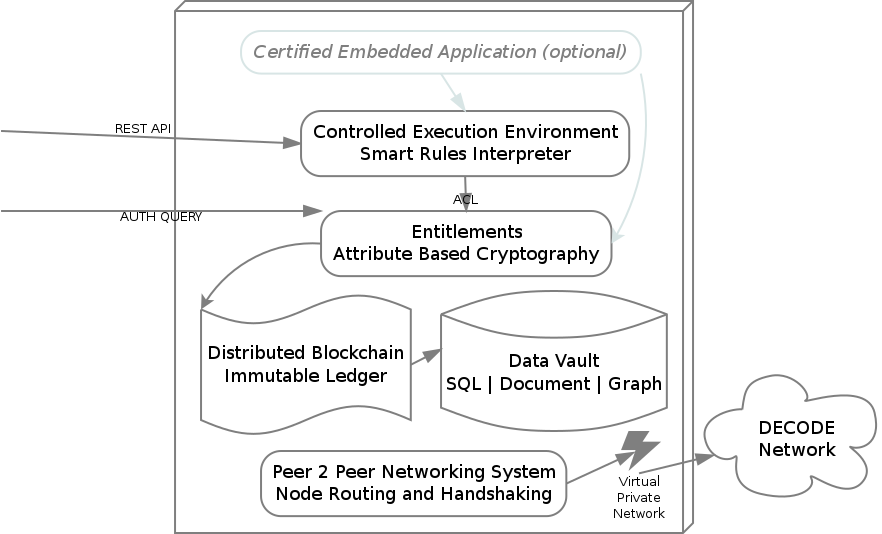

# Outline

This documents describes the design of the DECODE architecture. The document will evolve over time and will be published as a versioned series.

| Version | Date Published |
| ------- | -------------- |
| 0.1     | YYYY-MM-dd     |


DECODE is ...

WHY THIS WHITEPAPER: ...

This whitepaper is structured as follows. We first describe the functionality the architecture should implement, together with the main non-functional requirements (like security and privacy and ...). We then give a high-level description of the conceptual foundations that are brought together, before digging deeper and discussing the main components. We describe the function and responsibility of these and how they relate to each other. We then discuss what kind of applications can be built with DECODE and provide some examples.

This whitepaper will be updated regularly to include new functionality and improved designs. The current version describes the minimum viable product (MVP).

# Introduction to DECODE

## What is DECODE and why is it important?

DECODE aims to design and implement a free and open source, reliable and distributed architecture to run applications developed by third parties.

The DECODE architecture must be secure, distributed and privacy
friendly as it will host different privacy sensitive applications in
parallel.

DECODE is made of:

- a set of specifications for distributed ledgers to support decode
- a free and open source reference implementation of a distributed ledger
- a smart rule language that can be translated and graphically represented
- a GNU/Linux based operating system that can execute signed smart rule applications
- the documentation needed for operators to write and deploy smart rules that request access to private data
- an intuitive graphical interface for participants to allow smart rules to access their private data
- an ontology of attributes for private data that is aggregated by operators
- an attribute based cryptographic implementation that can grants access to data

DECODE main goals are:

- allow *participants* to manage access to their *private data*, by granting and revoke access to parts
- allow *operators* to write *smart rules* sign them and get the authorisation to run them on DECODE
- allow *smart rules* to access *private data* based on *entitlements* and matched *attributes*
- allow everyone to record *entitlements* on a *distributed ledger* whose integrity is resilient and verifiable

TODO: description of 1-2 use cases once the first pilot in Amsterdam and Barcelona are selected, e.g. collaborative economy/hospitality (FairBnB) and participatory citizen sensing (Things Network, Fitbit)*

3 exemplar use cases / demo apps:

- A) Citizen Sensing - Air quality for a location
- B) Asset sharing / renting (TBD, equivalent of FairBnB)
- C) Complex privacy (TBD, either in terms of participants or varying based on context)

## History and current "state of the art"

## Alternatives to DECODE


# Conceptual Framework
## Privacy by design
## Distributed Ledgers
## Attributes and Identity
## Attributes and entitlements
## Attribute verification with ABC
## Attribute Provenance
## Entitlements and ABE

- Declaration of Entitlements
- Implementation (Access control)
- ABE as an implementation


We first describe the DECODE architecture at a very high level of abstraction. In the sections to follow we will discuss each of the components, and how they are implemented, in detail.

Entities

- users (citizens)
- governments (cities)
- businesses (SMEs)

We broaden the scope to resources: data, but also devices. Resources are either *public* or *restricted*. (Some data is personal data, other data is not. The architecture cannot and does not distinguish that at the architecture layer.) Restricted data is *encrypted*. All data is stored on a p2p, high availability, redundant data store.

The *publisher* of restricted data determines who has access to the data. To this end it attaches an *entitlement condition* to the restricted data. Users wishing to obtain access to the data need to prove they possess the necessary *entitlement*. Entitlements can be *issued* to users. Entitlements have a *lifetime*: they are not valid before and not valid after a certain time. Additional flexibility can be expressed through *smart contracts* that, given a set of inputs (consisting of entitlements but also other *context*, like the current location or the current time or date) yield an entitlement. Smart contracts are stored and executed on a *distributed ledger*. Users store[^store] their entitlements privately.

```
tomd: here we need to refine.. entitlements are possibly dynamic, as mentioned in the footnote; also, currently it is not clear that we will execute the contracts 'on the ledger', or just use the ledger as a means of verifiation -- this is mentioned below, as well
```
[^store]: Maybe entitlements do not even exist when not needed or used, and only come into being when needed.

(So, for example, a home owner wishing to allow his guests access to the local Wifi could create an entitlement `john-doe-house-wifi`, a smart contract saying "*if someone has an entitlement `renting-john-doe-house` and this entitlement is valid now, then output the entitlement `john-doe-house-wifi` valid for one hour*". Then if the owner rents out his house and issues the renter the entitlement `renting-john-doe-house`, access to the wifi is securely arranged automatically.)

Data sources[^datasources]:

- "Streaming" data from sensors
- open government data
- user generated content (blogs, recommendations, observations)
- personal attributes & usage data
- ...

[^datasources]: Not sure whether we need the distinction, although streaming sensor data seems to be a
special kind of data that we need to reckon with. (JHH)


**Entitlements**

**Declaration**

```
tomd: this needs to be rewritten / elaborated, in the current form it does not address the idea of attribute-based dynamic entitlements.
```

Entitlements describe the access a subject has to some data item. They can be considered similar to descriptions of entitlements for example such as described by [AWS IAM](http://docs.aws.amazon.com/IAM/latest/UserGuide/access_policies.html).

We can define two parties in any given data exchange, the **data owner** and the **data consumer**. 

There are 4 key elements to an entitlement declaration:

- What **data attributes** are being shared
- With **whom** is the data owner sharing data
- For what **purpose** will the data consumer
- Under what **conditions** will the data consumer use the data (e.g. https://opendatacommons.org/licenses/pddl/)

**Audit Trail of data access**

Alongside controlling access to the data, decode will also ensure that access to data is **audited**. This is made possible by virtue of the fact that in order to interact with decode, a participant will need to be registered. In particular ***operators** will need to be registered and have some level of authenticity - for example be traceable to a company registration (e.g. in UK companies house). This allows a far greate level of transparency to both the participants and regulatory authorities (e.g. city council) of what data is being shared where.

**Data Receipts**

Alongside audit trails we also wish to make it clear to the participant exactly what entitlements they have granted in a simple manner. An example of work in this area is https://www.digitalcatapultcentre.org.uk/project/pd-receipt/ who are developing ideas around the user experience of how to represent entitlments a user has granted.

**General Data Protection Regulation**

https://en.wikipedia.org/wiki/General_Data_Protection_Regulation

How does this impact / have relevance to decode?

**Access to individual data attributes**

Rather than attempting to build a hirearchical entitlements system by classifying certain attributes into privacy groups, such as "sensitive, personal, public" DECODE specifies all entitlements at the granularity of individual attributes.

For example, suppose that an entity with DECODE account ID#234 owns a data item which represents their personal profile:

```
{
    :schema "http://.../person"
    :attributes {
        :decode-id "#234"
        :first-name "Xxxxx"
        :last-name  "Xxxxx"
        :date-of-birth "YYYY-mm-dd"
        :passport-number "XXXXXXXXXXX"
        :gender "xxxx"
        :address {
            :number "0"
            :street "Xxxxxxxx xx"
            :town "Xxxxxx"
            :district "Xxxxx"
            :postal-code "xxxx"
            :country "XXX"
        }
    }
```
Person ID#234 wishes to grant a Consumer ID#567 access to some subset of thier data. ID#567 may be another individual or a DECODE application that is going to aggregate the data for some purpose.

DECODE defines three possible access levels:

| Access level    | Description        |
| --------------- | ------------------ |
| `invisible`     | Subject can see neither the existence of this attribute, or its value           |
| `can-discover`  | Subject can see that the data item has a value for this attribute, but not what it is |
| `can-read`      | Subject can both see that the data item has a value and read that value  |

In this example the consumer ID#567 is the subject and we can represent the entitlement as follows:

```
{:created 2016-03-30T20:24:34.412-00:00
 :valid [:from 2016-03-30T20:24:34.412-00:00 
         :to 2017-03-30T20:24:34.412-00:00]
 :subjects [#567]
 :schema http://.../person
 :owner #234
 :signature af4534faaacd34552344
 :access {
   :decode-id :can-read
   :first-name :invisible
   :last-name :can-read
   :date-of-birth :invisible
   :passport-number :can-discover
   :gender :invisible
   :address {
     :number :invisible
     :street :invisible
     :town :can-read
     :postal-code :invisible
     :country :can-read
   }}
} 
```

Notice that the entitlement has a specific time range that it is valid for. It also specifies specifically the list of subjects to which it applies, and the type of data. In this case the entitlement is to a **class** of data, it could also be to a specific data instance.

It indicates the entity which owns this data. It is also signed by the owner so that this entitlement can be verified.

Finally the granular access levels are declared for each specific attribute.

An entity may grant multiple entitlements to the same subject for the same data, but operating under different circumstances, for example, lets say the person in this case has agreed to book a room for rent - once the transaction has reached the point that the booking is confirmed, they are happy for the passport number to be revealed:

```
...
  :access {
  ...
    :passport-number :can-read
  ...
  }
...
  :conditions {
    :booking-status "confirmed"
  }
...
```

(Only the delta to the previous entitlement is shown).

In most cases, the participants in the system will not be creating the entitlements directly, they will be interacting with DECODE applications. These applications will have the ability to declare what entitlements they require and the participants can agree to them, in much the same way that users can accept authorisation grants using OAuth.


**Access control**

**Principle: Access control should live with the data**

For example if the data has been aggregated into a central store, access should only be provided to that data through an API which has access control embedded within it, and which understands the DECODE entitlement policy.

Other ways that this can be achieved are via encryption where the access control is directly related to the data.

Defining and declaring entitlements is a matter of describing access rules. In order for these to be useful we require a mechanism to enforce them. In a traditional system we would simply "trust" that the system has been coded to take account of the entitlement declaration - for example we might install an authorisation server product to define and store entitlements and rely on the developers of the system to code appropriate controls into the system that communicate with the authorisation server.

**Patterns of Access control**

Three patterns of access control of varying sophistication are:

- Data Vault (api access to aggregated data)
- Individual Public Key Encryption - Encrypt data with a master key and then encrypt that key multiple times to different individuals.
- Utilise ABE such that an attribute based key can be used by multiple data consumers.


**Attribute Based Encryption**

Key based encryption which is based on attributes about the participants - for example a key is created based on the fact that a person is a resident of the city of barcelona. The data can be encrypted in such a way that anyone with that attribute in their key can decrypt.

**Q** How does ABE prevent collusion?

**Controlling access to individual data attributes**

As well as the attributes of the participants, there are also attributes of the data items - as we wish to have a fine grained control of these we require a design which allows individual data attributes (should this have a different name? maybe data elements?) to be controlled individually.

For example:

I want to allow all residents of barcelona to see my name. I want to allow residents of my street to see my name and see my full address.

How is this implemented cryptographically?

ABE provides an answer for controlling based on people who are residents of barcelona or on my street. Options:

- Encrypt multiple versions of the data with different combinations of attributes - will end up being combinatorial explosion
- Encrypt each attribute independently, using ABE

The second option could work but will be computationally expensive for large data sets?

**Controlling access to large datasets or streams of data**

We require a mechanism for controlling access to either large datasets or streams of data. Perhaps I wish to publish a dataset including all my movement data from my phone for the last two months and yet control access to certain attributes.

Options:

- Encrypt each data item in the list as above
- Separate the data into "columns" ie. each data attribute is becomes an array of values and these are then encrypted using ABE
- Investigate DRM tech for encrypting large (e.g. Video) streams can similar approaches be applied to user data?


**Identity**
Identity within DECODE inverts the current world position whereby participants know little about the operators of the services they are registered with but the services know everything about the identity of the participants. “Vendor relationship management” so to speak; where the vendors are DECODE-enabled applications.
In DECODE, the focus is on strengthening the position of the participant in terms if understanding exactly what organisations are operating applications and what those applications are doing with the participants' data.

**Participants**
The identity of the participants is irrelevant to the DECODE system, and also to the applications that run in the DECODE ecosystem. What ís relevant are the attributes that are related to the participants. We would go as far as to say that identity is a concept not needed at all.In the real world we live and act in many different contexts, these activities and the relations in those contexts each define a perspective on who we ‘really’ are. There is overlap, sure, but there is no context in which **all** aspects of us are relevant. So, what is our identity? 

There are three options: 

1. identity is what **we** think **we** are (i.e. self)
2. It is how the state defines us, typically through a number or code assigned at birth
3. It is the combination of all perspectives from all contexts combined

In the DECODE ecosystem we will keep the diverse and subtle ways of addressing aspects of our lives and selves in different (online, digital) contexts, and leverage the capacity of the medium to improve upon this in a privacy enhancing fashion. When thinking of identity in this ecosystem, option one, above, is irrelevant, and option three is fine in an abstract way, but fraught with privacy issues when it would be possible to address & use practically. That leaves the extremely narrow definition of the government assigned civic number. Apart from the issue that people exist without such numbers, this is just a single attribute of a person, at best a strictly formal (or legal) definition of identity, but missing out on just about everything we are. 

Better to avoid discussion and confusion and **not** to use the word identity at all, and talk about different collections of attributes, relevant in different (online, or even DECODE-supported offline) contexts (or *applications*). 

Let’s call such a collection a ‘**persona**’ for now.

In the end we are talking about physical people (AI’s with civil rights are a ways off), even when assigning attributes that are purely abstract, or are transferable, these are about, or related to a person. This person is represented in the DECODE ecosystem as a persona, but **not uniquely**. One physical person will have control of the data related to multiple **personas**. These may overlap (in the values of certain attributes), or may not. 

These personas aren’t entities in the DECODE system, they are a way of talking about *application-defined* collections of attributes. Personas are the subject of **entitlements**, even when, for instance, the only attribute needed for the online alcohol-buying app is the age, that app would, in its use, **define** a persona with an age, and nothing else at all. For the sake of argument we leave out practicalities as payment, and the address to send the purchase to.

The connection to the real person in the real world is through a DECODE account that the person will authenticate against in order to interact with DECODE applications. This account is not part of the decode data that these applications have anything to do with, although the authentication app or apps (multiple means of authentication) could be seen as a special kind of DECODE enabled applications.

Authentication usually involves a participant providing various personally identifying facts to a system such as date of birth, passport id / driving licence number, potentially with additional offline checks and questions of the participant. For example in signing up to the UK's [gov.uk/Verify](https://www.gov.uk/government/publications/introducing-govuk-verify/introducing-govuk-verify) you register with a federated identity provider (e.g. The Post Office). The post office has a mobile app that can capture images of your passport, OCR the details and confirm them against the HMPO (Her Majesty's Passport office) and then takes a photo using the phone camera in order to compare against the photo on the passport.

A participant demonstrates control of these **attributes** through some cryptographic means (essentially by holding a private key). This private key may be embedded on a physical device that the participant owns, such as a [Ubikey](https://www.yubico.com/products/yubikey-hardware/) or Smart Card issued by a civic authority. In the case of a device issued by an authority it may also contain attributes of interest to other DECODE applications, such as the fact that one lives in a particular city. These attributes, when stored, record the provenance and the semantic meaning of the relation in their urn, and can so be ‘officially verified’ attributes that certain applications may require (such as voting in participatory budgeting applications, see below).

```
tomd: don’t really get the essence what you are trying to say in the 'operator' section; maybe relevant elsewhere in the document?
```

**Operators**

Identity is transparent to a known and registered organisation that a participant can discover and make a choice about wether to interact with or provide data to. For example an app mayb be operated by a company which will be required to be registered in the civic records for a city / country and a link made between the app, the operator and such records. In the uk there is the example of Companies house which can be accessed via a URL, for eg https://beta.companieshouse.gov.uk/company/04091535.


**How is verification implemented in DECODE?**

DECODE will **not** provide the role of **identity verification**, however it will provide an integration protocol to allow **claims** made by participants to be leveraged in DECODE interactions (specifically, smart rules). These claims may lead to **entitlements**.

A core functionality of DECODE is **verification** of **claims** that an individual makes about themselves. For example "I live at 00 Xxxxx Xxxxxx" or "I am over the age of 18" or "I am a resident of Barcelona city". These claims may be important in a particular application use case. For example if we have an application which allows voting to residents of Barcelona, we might want to be able to verify that the persona as defined by the voting application is also a resident of Barcelona. Furthermore, the application defines a secure and uniquely identifiable attribute, together with a smart rule that only allows a single vote for any particular ballot. Through using DECODE, the attribute does not have to expose any real knowledge (for example a citizen ID number) but it must be possible to be checked for a particular value (number of votes cast).

So how are claims actually verified in the first place? In the example, the entity responsibile for verification would be the city of Barcelona. This could be a physical process, or could be done online (as in the Dutch DigiD mechanism), and involves some exchange between the city and the individual. The result of this exchange would be a cryptographic token, signed by the city, which, invoked with a specific smart rule would result in an attribute with verified provenance and value being set in the DECODE platform. This attribute would be available for that person to use in any application relying on it.  This whole process could take place through a website which is run by the city of Barcelona (and thus is a DECODE enabled application). Required will be a mechanism by which the DECODE network can **trust** the public key of the city of Barcelona, i.e. there will need to be a registration protocol to establish this trust.

The User Journey for this interaction would involve the person authenticating with their account on this website and then creating a "city_of_residence: Barcelona" attribute signed with the city’s private key. In this example there would be a validity time limit on this attribute, a month, perhaps. People move.
Because the choice of using applications that reference this attribute is in the hands of the participant they have strong control of how this link is used. In a p2p sharing application a different proof-of-residency attribute may be good enough, for instance.

In order to make it straighforward for developers to build DECODE applications, the mechanisms for interacting with and validating external or ‘official’ claims will be a core part of the language that is used to express Smart Rules.


**Authentication**

For the purposes of DECODE we define authentication as being the mechanism by which a participant gains access to the system in a controlled way such that only that participant can access and control the DECODE data associated with themselves.  
Password-less Authentication
A core goal of authentication for decode is that we should aim to have authentication without passwords.

Options for the implementation of this include:

-	one time codes sent to a device
-	Device OS security (e.g. fingerprint on a mobile phone or laptop)
-	Embedded authentication in the device, rely upon general OS security such as locking screen on a PC

We also make the observation that in general, security and privacy on the device is not the core purpose of DECODE - of much greater concern is privacy and control of data once it leaves the device and enters the network.

For example, if I gain access to a persons device (e.g. Laptop) there is already enough of a compromise in terms of being able to access all their non DECODE material that it is potentially not worth having a secondary control on the application itself.

This topic requires further investigation, threat modelling and discussion, however we will aim to attempt to only implement password protection as a last resort.


# Architectural Principles
## Free and Open source
## Reuse what works
## Modularity and interoperability
## Decentralisation and federation

- **Openness** of the platform, to enable innovation and citizen
participation.
- **Flexibility** through smart rules, driven by the needs of the usecases.
- **Transparency** and **auditability** of collective action and choice, privacy
of individual actions.
- **High-integrity**, appropriate **privacy** options, and **availability** against
disruption and suppression.
- **User-friendliness** for end-users, and app developers for **easy
adoption**.
- **Scalability** and **deployability** to compete with corporate and closed
platforms.


# Operating system architecture

The DECODE OS is the base operating system running all software designed, developed and deployed for the DECODE project. This operating system is based on the renown Devuan GNU+Linux distribution, a fork of the now 20 years old Debian distribution, maintained by the Dyne.org foundation and an open community of volunteers. Devuan forked Debian to preserve the simplicity and minimalism of the SystemV tradition in UNIX systems, still running modern software applications and inheriting the security patches from Debian.

The first release of the DECODE OS is made available at the Internet address https://files.dyne.org/decode/OS and it incudes fully functioning virtual machine images (Vagrant/vbox and Qcow2/Qemu formats) implementing a base architecture (kernel and base system tools) to build, run and connect a diverse range of future applications. The DECODE OS is provided to developers of the DECODE project along with comprehensive documentation and tools to reproduce its build, benchmark and audit its functioning, as well with a dashboard for live monitoring.

The primary goal of the DECODE OS can be explained in brief by defining it as a "controlled execution environment" where, from the making of its base to the execution of every single application, all steps are recorded on a ledger of events that can be saved, analysed and shipped along with every instance of the operating system. A secondary goal of this development is that of making the results of such a recorded sequence of operations reproducible.

The DECODE OS both as a product but also as a well defined process leading to its release aims primarily at satisfying the following main objectives:

- Adopt free and open source software compliant with any of DECODE's approved licenses. Make the source-code of any running software immediately available for audit. Avoid any dependency from proprietary software.

- Rely on widely used, peer-reviewed and stable applications and standards from GNU/Linux/BSD software traditions for its base functions.

- Make the whole building process transparent and auditable, providing schematic information about all adopted components that can be short and to the point, as well machine parsable.

- Realise a minimal, lean and resource aware operating system running as less processes as possible, to avoid complexity and to facilitate the controlled execution of micro-services.

- Rely on a continuous-integration infrastructure (see D4.2) able to integrate the dependencies and applications of DECODE developers with as less friction as possible.

- Provide an optimal developer experience by providing two distinct profiles: "-dev" for development and "-prod" for production use and a way to switch between development and production that is seamless.

- Maintain an exact history of changes made to the OS as well builds triggered, reflected in the final product and auditable according to a map of liabilities drawn during the build process.

- Integrate benchmarking tools and a live monitoring dashboard to facilitate quality assurance assessments and the review of resource management under different conditions. Also allow the customisation of the dashboard to include future application specific indicators.

- Target a wide range of hardware architectures and well-established chipset standards, virtual machines and cloud providers, without requiring any significant change in the base system, just a different setup of the continuous-integration pipeline.

- Refer to well established UNIX standards for the configuration of the system and process control. Avoid any binary configuration format and adopt as much as possible input and output formats that can be both read by humans and easily parsed by machines.

- Enforce full-spectrum process separation between all different applications running on the DECODE OS, making it possible to isolate problems and eventually recover functionality.

## Process separation

DECODE's implementation of a distributed computational system aims to be solid and fit for mission critical purposes by leveraging well established standard practices in the UNIX world. Contrary to the monolithic applications implementing blockchain functionalities in a single runtime environment running in application space, our implementation of a "DECODE NODE" (see D1.1) is a controlled execution environment unit for Smart Rules grafted on the classic concept of a UNIX-like operating system, keeping POSIX.1b and SystemV compatibilty. This approach brings several advantages:

- The system is familiar to system administrators and can be monitored and managed using existing well known tools.
A DECODE NODE is backward compatible with the vast majority of existing entreprise infrastructure.

- Planned and documented integration between application specific functions and the underlying OS, verticalising the full stack and providing a fully certified environment for smart rule execution.

- The security of the DECODE NODE is granted by means of stable Linux based access control lists (ACL) and firewalling.

- The diagnosis of problems occurring on running nodes is fully compatible with already established practices of logging, tracing, profiling and debugging processes.

- Components can be mixed in a modular fashion, allowing reusal of existing implementations in different roles, including production ready software for network orchestration, p2p networking, data storage presentation, cryptographic operations and immutable ledger functions.


## Privilege escalation


Intelligence communities use the concept of "need to know" as a way to minimize information leaks and only grant access to secrets when it is absolutely necessary for the performance of an agent's action. In computer security, the same concept can be translated for _privilege escalation_: the need for a program to execute actions not normally available to its calling user. Often used offensively to gain control of a target machine or extract information, privilege escalation has also legitimate use, for example to enable a desktop user to perform administrative actions such as rebooting a running system or upgrading its software packages.

In case of the DECODE privilege model for data access the intention is to maintain defense in depth by granting the integrity to the underlying operating system in addition to the cryptographic security model implemented by the application layer, because a node that is compromised by a rogue process escalating its privileges could anyway jeopardise the validity of results provided by the smart rules computations happening on it.

In order to avoid such a situation, DECODE adopts a privilege escalation model based on a hard-coded hash-table that is inscribed into its operating system. The standard C (POSIX.1b) implementation for this model is called *sup*, currently maintened by Dyne.org and well known to the security community especially in the context of embedded development. Its website is visible at <https://sup.dyne.org>

The *sup* binary runs as root (with suid bit on) to facilitate the privilege escalation needed to execute certain programs as superuser, for instance to open a listening port below 100, for a web or an SMTP server. In order to regulate the privilege escalation *sup* handles a few conditions to authorize execution, all hard-coded in a static ELF binary.


\pagebreak

An example `config.h` is here:

``` c

struct rule_t {
    int uid; // user identifier
    int gid; // group identifier
    const char *cmd; // command
    const char *path; // fixed path to the command (or * for any)
    const char *hash; // SHA256 hash of the binary
};

static struct rule_t rules[] = {
{ USER, GROUP, "pgld", "*",
"47c045091bd152cbc2d4a2a3bf1b7b42d5b185d39ccba08b2aa51a21" },
{ USER, GROUP, "webui", "*",
"0063bb188264830b28129416a8ee070ac7c894f66b2b8b9f355ff617" },
{ USER, GROUP, "route", "*",
"d725571c48ac45130c15274204ffae07bb9607b06610e8f7a26d89e5" },
{ USER, GROUP, "dnscrypt-proxy", "*",
"ce69a33f43f399b9b4e50db21eb5cbf73ba291544d65d5cc209cf607" },
{ USER, GROUP, "modprobe", "*",
"ecf184748467fe4c6d561e3e3813f028f03ba9b7affe10855df4538b" },
{ USER, GROUP, "ebtables", "*",
"a4e4b6de1fa9527892aae8d3e9f0a6e60c6d99725ba5acee7aaf7751" },
{ USER, GROUP, "xtables-multi", "*",
"adee44923e1f20d6cb168ea5f51e5abefc5d07f476fd82e79fb6fa75" },
{ USER, GROUP, "ifconfig", "*",
"d13a85ca313d24261a520cd4f33087679edded86308dd6a23047cfb0" },
{ USER, GROUP, "nmap", "*",
"8b2cc682660baf70513f13287531c869f1c233466888414a4fd65caf" },
{ USER, GROUP, "dhcpd", "*",
"b45a15c8b4f3e4114ec825a5dcc961f32f0f44d0fe9ed5cda8d8f4de" },
{ USER, GROUP, "kill", "*",
"0f277f0cdc17952156a63a246f19345031e27e02baf8434f7a4aa6ce" },
{ USER, GROUP, "sysctl", "*",
"239eb3eafeb39ed3a28420c34164fa2f11daf3993cc139352d8ddbeb" },
{ 0 },
};
```

For the DECODE OS an "allow list" is provided to *sup* at the time of building the ISO installers and SD card images, so that running "*sup* application" will escalate the privileges of application without the need of any password, in case the application is included in the "allow list". In order to extend the list of applications allowed to escalate privileges within the execution environment of the DECODE OS, a new build of it must be provided.
Binaries change their contents across builds that are targeted to different architectures (i386, amd64, armhf, arm64, etc.) therefore the hashes in the allow list will change for each targeted build.

The *sup* binary itself is authenticated by the "root" signature of each DECODE OS which is shipped along with the ISO or installer or SD card or virtual machine image formats. The cryptographic signature of DECODE OS verifies all the binaries of the system in their current state as released, including *sup* whose unique binary footprint changes at every change of its privilege escalation hash table. Therefore any change in any binary that can escalate its privilege via *sup* will lead to a change in the *sup* binary itself, which will lead in a change in the signature of the whole DECODE OS.

This way of authorising the execution of software applications is not only implying that a particular binary can escalate privileges, but also that a particular build of that program can. It means that even if the binary is substituted with another one by modifying the installer image of the DECODE OS, it will not be able to be executed with privileges, denying the possibility to run effectively counterfeited DECODE OS images, as this check is combined with the check of a cryptographic signature for the whole OS image.


### Security implications

This privilege escalation model improves the overall security of the DECODE OS as a system where it can be pre-determined what needs to run with privileges, harnessing the main difference with desktop systems that are interactively configured and whose privilege model can be changed by users.
When this model is used in combination with a security enhanced Linux kernel, it constitutes a very robust foundation for the realisation of a secure operating system that executes a predetermined set of computing processes.

DECODE's privilege escalation model provides overall better security against the breach of the system integrity, but it cannot be considered a blanket solution for the security and integrity of the whole DECODE architecture. It is a reasonably strong measure to insure the integrity of operations at the core of the DECODE OS, granting integrity for the execution machine.


### Technical implications

For the developers involved, DECODE's privilege escalation model means that every software application, be it binary compiled or scripted executable, needs to be registered with its hash inside the OS at build time. To change such an application a whole new build of the DECODE OS needs to be triggered. This is of course a setting necessary to produce production ready installers, but it can be de-activated for testing environments.

The other main implication is that each and every program executed with privileges cannot arbitrarily execute other programs that are configured at runtime. For instance a privileged process cannot have a variable that can be configured at runtime to call another program. An exception to this rule can be the implementation of a mechanism to drop privileges inside the program, which should be throughly reviewed: such implementations exist in C, however the need for such an exception should be avoided.

Regarding updates, patching a running system would entail a reboot after downloading a new OS version, which will be distributed in a "squashed" bundle (squashFS). This wouldn't mean to reinstall the entire OS, but to download and reboot into a new signed binary system.


### Political implications

The model by which privilege escalation is granted to processes running in the DECODE OS is intentionally resistant to changes, which need to be implemented and recorded in the history of revisions before the build process. This model forces a clear negotiation of privileged process, allowing a debate on such choices that is extended to all technical stakeholders. The process of privilege escalation should be in fact seen as a political negotiation about which algorithms are allowed to deal with more delicate parts of the operating system.


## Application modules

Considering a first abstraction of functionalities, mostly resulting from the study of user-cases and currently adopted pilots in DECODE, it is already possible to envision a set of modules whose functionalities can be satisfied by a considerable number of stable software implementations. The following figure shows the functionalities that can be contained in a DECODE node, each of them can be a different software application running as an isolated process, whose communication channels can be specified at the time of building the DECODE OS and cannot modified unless the design of the OS is re-negotiated according to clear needs and specified patterns.



The modules listed in the figure above are:
- Smart Rules language interpreter and controlled execution environment
- Entitlements ACL layer based on attribute based cryptography
- Distributed Blockchain providing an immutable ledger
- Data storage (Vault) in different possible formats (Document or Graph)
- Peer to Peer Networking Orchestration System and VPN

The modules listed can be implemented by new software developed by the DECODE consortium as well as by existing and well established open source standard implementations. Being this the first release of the DECODE OS it is well out of the scope of this document to envision which software will satisfy these roles, as well the listed modules may be subject to further adjustments as new needs and refinements become manifest in the coming research iterations.

What matters to us now is the fact that there is a clear way to include such SOFTWARE modules inside a coherent and well documented system built from source and that the overhead to substitute a module with another implementation is minimum. Each application is an installed software package that is ran at startup, whose health is monitored by the system and whose failure does not propagates to other system components.

This architecture also allows to map the inner architecture of a NODE as well to envision the possibility to produce different NODES that are tailored ad-hoc to different use-cases. As a last note, the architecture also includes the possibility to have an optional application to be ran inside the NODE and interact with some of the components inside it: this is an opportunity DECODE OS can leverage for special applications requiring intensive communication with inner components of the DECODE NODE.


# Hardware architecture

```comment
TODO: find a better title for this section
```
## Relay nodes (validating nodes)
- User Interface

## Wallet nodes

- User Interface

## Hardware Hubs
## Keys and smart cards
## IOT connectivity
## P2P networking

- p2p
- Identity?
- Relationship to the ledger? 


# Distributed ledger
## Reference to chainspace
## Contract requirements
## Crypto requirements

The DECODE platform architecture has at its core a *distributed ledger* implementation. This provides the the capablities of availablilty and integrity. The core function of the ledger allows for distributed, redundant storage of objects and the verification of execution of smart rules.

``` 
tomd: we do not store objects in the ledger, I think. Only hashes for verification of various components and transaction information (audit trails?)
```

```
jimb: the core functionality of chainspace allows for data to be stored as object. The domain model that it uses involves "Objects" and "Transactions" what would be potentially worthwhile in this section of the white paper is a quick summary of that. We can link then to the soon to be published Chainspace white paper for more details.
Wether we choose to store real data in the ledger or not is then a privacy design issue. We could work through the example of the rental register to explore this topic further, if the rentals themeselves are recorded on the ledger how would we answer the question "how many nights has this property been rented for this year?"
```

In DECODE, smart rules are executed *outside* the ledger, and the results are submitted to the ledger for storage and verification. In this way, we allow for a completely private application to be written because the only requirement of the ledger is that it be *provable* that an execution is correct, the ledger does not need to actually execute the transaction itself. For example one could write a smart rule that can be verified through the use of a [Zero Knowledge Proof](https://en.wikipedia.org/wiki/Zero-knowledge_proof).

This separation of *execution* from *verification* is a fundamental design principle of the ledger.

The ledger operates as a series of managed nodes running across the internet. The design of DECODE allows for multiple parties to operate networks of nodes. Further, when desiging a smart rule, the designer can select which node providers may execute the rule. Participants using the application and submitting transactions will have clear visibility of which organisations are participating in validating and accepting their transactions.

Where checks are required of multiple inputs and outputs to a transaction (e.g. to avoid a double spend scenario), all the input transactions will require to also be known to the validating network.

**Enabling queries over the ledger**

**TODO:** Discussion around how one can query the ledger securely - i.e. in order to query, an index view or projection needs to be created across the data. How is this possible if all the data is private for e.g.? Perhaps related to entitlements and meta data


# Smart rules Engine
## Language requirements
## Usability and perception

- User interface and visual languages

## Deterministic and proovable computation


- a language to express rules
- Ricardian contracts?


# DECODE Applications
## What is a DECODE application?
## Example - Petitions
## Example - IOT entitlements


# Conclusion

# References

```comment
Needs to come from bibtex bib.
```

# Glossary of terms


