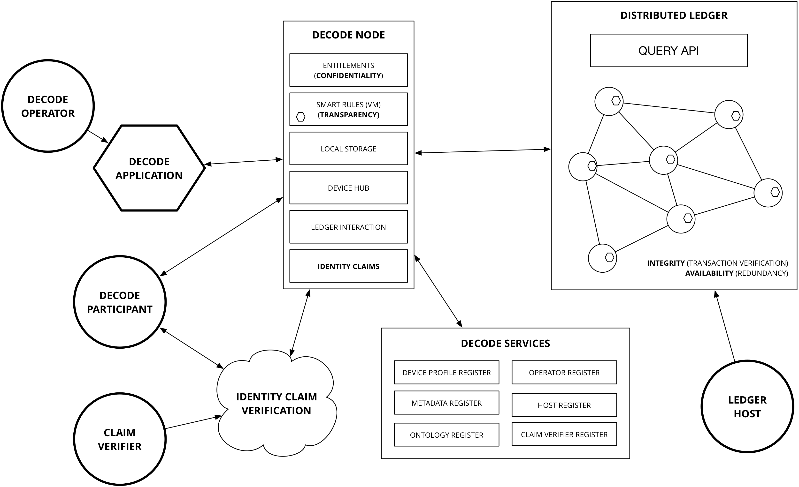
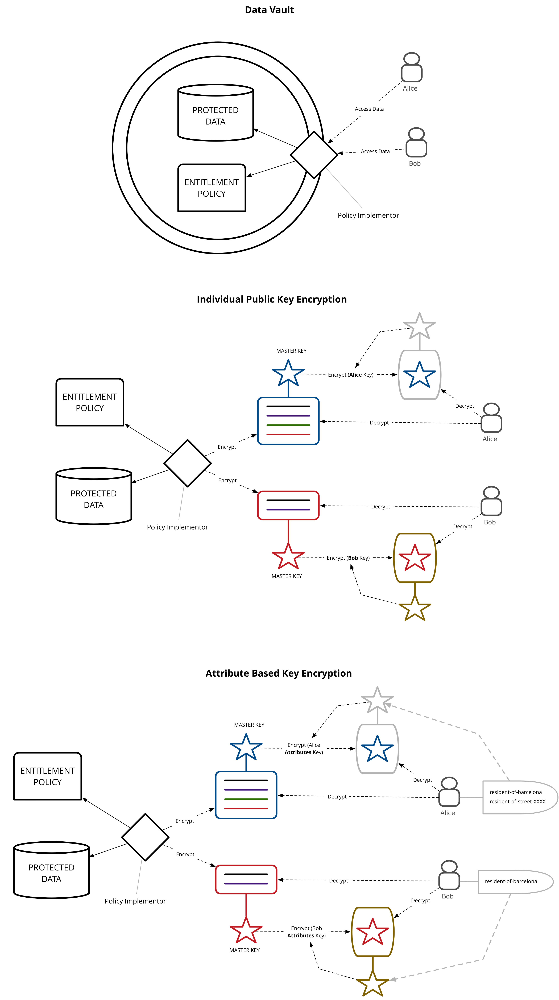
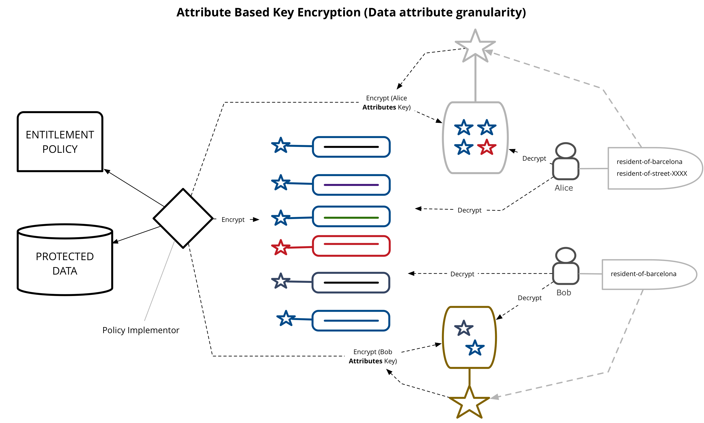

# Outline

This documents describes the design of the DECODE architecture. The document will evolve over time and will be published as a versioned series.

| Version | Date Published |
| ------- | -------------- |
| 0.1     | YYYY-MM-dd     |


DECODE is ...

WHY THIS WHITEPAPER: ...

This whitepaper is structured as follows. We first describe the functionality the architecture should implement, together with the main non-functional requirements (like security and privacy and ...). We then give a high-level description of the DECODE architecture, before digging deeper and discussing the main components and how they are implemented in detail.

This whitepaper will be updated regularly to include new functionality and improved designs. The current version describes the minimum viable product (MVP).

# Functionality

DECODE aims to design and implement a free and open source, reliable and distributed architecture to run applications developed by third parties.

The DECODE architecture must be secure, distributed and privacy
friendly as it will host different privacy sensitive applications in
parallel.

DECODE is made of:

- a set of specifications for distributed ledgers to support decode
- a free and open source reference implementation of a distributed ledger
- a smart rule language that can be translated and graphically represented
- a GNU/Linux based operating system that can execute signed smart rule applications
- the documentation needed for operators to write and deploy smart rules that request access to private data
- an intuitive graphical interface for participants to allow smart rules to access their private data
- an ontology of attributes for private data that is aggregated by operators
- an attribute based cryptographic implementation that can grants access to data

DECODE main goals are:

- allow *participants* to manage access to their *private data*, by granting and revoke access to parts
- allow *operators* to write *smart rules* sign them and get the authorisation to run them on DECODE
- allow *smart rules* to access *private data* based on *entitlements* and matched *attributes*
- allow everyone to record *entitlements* on a *distributed ledger* whose integrity is resilient and verifiable

TODO: description of 1-2 use cases once the first pilot in Amsterdam and Barcelona are selected, e.g. collaborative economy/hospitality (FairBnB) and participatory citizen sensing (Things Network, Fitbit)*

3 exemplar use cases / demo apps:

- A) Citizen Sensing - Air quality for a location
- B) Asset sharing / renting (TBD, equivalent of FairBnB)
- C) Complex privacy (TBD, either in terms of participants or varying based on context)


# Architecture overview

We first describe the DECODE architecture at a very high level of abstraction. In the sections to follow we will discuss each of the components, and how they are implemented, in detail.

Entities

- users (citizens)
- governments (cities)
- businesses (SMEs)

We broaden the scope to resources: data, but also devices. Resources are either *public* or *restricted*. (Some data is personal data, other data is not. The architecture cannot and does not distinguish that at the architecture layer.) Restricted data is *encrypted*. All data is stored on a p2p, high availability, redundant data store.

The *publisher* of restricted data determines who has access to the data. To this end it attaches an *entitlement condition* to the restricted data. Users wishing to obtain access to the data need to prove they possess the necessary *entitlement*. Entitlements can be *issued* to users. Entitlements have a *lifetime*: they are not valid before and not valid after a certain time. Additional flexibility can be expressed through *smart contracts* that, given a set of inputs (consisting of entitlements but also other *context*, like the current location or the current time or date) yield an entitlement. Smart contracts are stored and executed on a *distributed ledger*. Users store[^store] their entitlements privately.

```
tomd: here we need to refine.. entitlements are possibly dynamic, as mentioned in the footnote; also, currently it is not clear that we will execute the contracts 'on the ledger', or just use the ledger as a means of verifiation -- this is mentioned below, as well
```
[^store]: Maybe entitlements do not even exist when not needed or used, and only come into being when needed.

(So, for example, a home owner wishing to allow his guests access to the local Wifi could create an entitlement `john-doe-house-wifi`, a smart contract saying "*if someone has an entitlement `renting-john-doe-house` and this entitlement is valid now, then output the entitlement `john-doe-house-wifi` valid for one hour*". Then if the owner rents out his house and issues the renter the entitlement `renting-john-doe-house`, access to the wifi is securely arranged automatically.)

Data sources[^datasources]:

- "Streaming" data from sensors
- open government data
- user generated content (blogs, recommendations, observations)
- personal attributes & usage data
- ...

[^datasources]: Not sure whether we need the distinction, although streaming sensor data seems to be a
special kind of data that we need to reckon with. (JHH)



## Core Technical Values

- **Openness** of the platform, to enable innovation and citizen
participation.
- **Flexibility** through smart rules, driven by the needs of the usecases.
- **Transparency** and **auditability** of collective action and choice, privacy
of individual actions.
- **High-integrity**, appropriate **privacy** options, and **availability** against
disruption and suppression.
- **User-friendliness** for end-users, and app developers for **easy
adoption**.
- **Scalability** and **deployability** to compete with corporate and closed
platforms.


# Architecture Components - How does DECODE Work?


## The nodes

## The network

- p2p
- Identity?
- Relationship to the ledger? 

## Smart rules

- a language to express rules
- Ricardian contracts?


## Distributed ledger

The DECODE platform architecture has at its core a *distributed ledger* implementation. This provides the the capablities of availablilty and integrity. The core function of the ledger allows for distributed, redundant storage of objects and the verification of execution of smart rules.

``` 
tomd: we do not store objects in the ledger, I think. Only hashes for verification of various components and transaction information (audit trails?)
```

```
jimb: the core functionality of chainspace allows for data to be stored as object. The domain model that it uses involves "Objects" and "Transactions" what would be potentially worthwhile in this section of the white paper is a quick summary of that. We can link then to the soon to be published Chainspace white paper for more details.
Wether we choose to store real data in the ledger or not is then a privacy design issue. We could work through the example of the rental register to explore this topic further, if the rentals themeselves are recorded on the ledger how would we answer the question "how many nights has this property been rented for this year?"
```

In DECODE, smart rules are executed *outside* the ledger, and the results are submitted to the ledger for storage and verification. In this way, we allow for a completely private application to be written because the only requirement of the ledger is that it be *provable* that an execution is correct, the ledger does not need to actually execute the transaction itself. For example one could write a smart rule that can be verified through the use of a [Zero Knowledge Proof](https://en.wikipedia.org/wiki/Zero-knowledge_proof).

This separation of *execution* from *verification* is a fundamental design principle of the ledger.

The ledger operates as a series of managed nodes running across the internet. The design of DECODE allows for multiple parties to operate networks of nodes. Further, when desiging a smart rule, the designer can select which node providers may execute the rule. Participants using the application and submitting transactions will have clear visibility of which organisations are participating in validating and accepting their transactions.

Where checks are required of multiple inputs and outputs to a transaction (e.g. to avoid a double spend scenario), all the input transactions will require to also be known to the validating network.

### Enabling queries over the ledger

**TODO:** Discussion around how one can query the ledger securely - i.e. in order to query, an index view or projection needs to be created across the data. How is this possible if all the data is private for e.g.? Perhaps related to entitlements and meta data


## Entitlements

### Declaration

```
tomd: this needs to be rewritten / elaborated, in the current form it does not address the idea of attribute-based dynamic entitlements.
```

Entitlements describe the access a subject has to some data item. They can be considered similar to descriptions of entitlements for example such as described by [AWS IAM](http://docs.aws.amazon.com/IAM/latest/UserGuide/access_policies.html).

We can define two parties in any given data exchange, the **data owner** and the **data consumer**. 

There are 4 key elements to an entitlement declaration:

- What **data attributes** are being shared
- With **whom** is the data owner sharing data
- For what **purpose** will the data consumer
- Under what **conditions** will the data consumer use the data (e.g. https://opendatacommons.org/licenses/pddl/)

**Audit Trail of data access**

Alongside controlling access to the data, decode will also ensure that access to data is **audited**. This is made possible by virtue of the fact that in order to interact with decode, a participant will need to be registered. In particular ***operators** will need to be registered and have some level of authenticity - for example be traceable to a company registration (e.g. in UK companies house). This allows a far greate level of transparency to both the participants and regulatory authorities (e.g. city council) of what data is being shared where.

**Data Receipts**

Alongside audit trails we also wish to make it clear to the participant exactly what entitlements they have granted in a simple manner. An example of work in this area is https://www.digitalcatapultcentre.org.uk/project/pd-receipt/ who are developing ideas around the user experience of how to represent entitlments a user has granted.

**General Data Protection Regulation**

https://en.wikipedia.org/wiki/General_Data_Protection_Regulation

How does this impact / have relevance to decode?

#### Access to individual data attributes

Rather than attempting to build a hirearchical entitlements system by classifying certain attributes into privacy groups, such as "sensitive, personal, public" DECODE specifies all entitlements at the granularity of individual attributes.

For example, suppose that an entity with DECODE account ID#234 owns a data item which represents their personal profile:

```
{
    :schema "http://.../person"
    :attributes {
        :decode-id "#234"
        :first-name "Xxxxx"
        :last-name  "Xxxxx"
        :date-of-birth "YYYY-mm-dd"
        :passport-number "XXXXXXXXXXX"
        :gender "xxxx"
        :address {
            :number "0"
            :street "Xxxxxxxx xx"
            :town "Xxxxxx"
            :district "Xxxxx"
            :postal-code "xxxx"
            :country "XXX"
        }
    }
```
Person ID#234 wishes to grant a Consumer ID#567 access to some subset of thier data. ID#567 may be another individual or a DECODE application that is going to aggregate the data for some purpose.

DECODE defines three possible access levels:

| Access level    | Description        |
| --------------- | ------------------ |
| `invisible`     | Subject can see neither the existence of this attribute, or its value           |
| `can-discover`  | Subject can see that the data item has a value for this attribute, but not what it is |
| `can-read`      | Subject can both see that the data item has a value and read that value  |

In this example the consumer ID#567 is the subject and we can represent the entitlement as follows:

```
{:created 2016-03-30T20:24:34.412-00:00
 :valid [:from 2016-03-30T20:24:34.412-00:00 
         :to 2017-03-30T20:24:34.412-00:00]
 :subjects [#567]
 :schema http://.../person
 :owner #234
 :signature af4534faaacd34552344
 :access {
   :decode-id :can-read
   :first-name :invisible
   :last-name :can-read
   :date-of-birth :invisible
   :passport-number :can-discover
   :gender :invisible
   :address {
     :number :invisible
     :street :invisible
     :town :can-read
     :postal-code :invisible
     :country :can-read
   }}
} 
```

Notice that the entitlement has a specific time range that it is valid for. It also specifies specifically the list of subjects to which it applies, and the type of data. In this case the entitlement is to a **class** of data, it could also be to a specific data instance.

It indicates the entity which owns this data. It is also signed by the owner so that this entitlement can be verified.

Finally the granular access levels are declared for each specific attribute.

An entity may grant multiple entitlements to the same subject for the same data, but operating under different circumstances, for example, lets say the person in this case has agreed to book a room for rent - once the transaction has reached the point that the booking is confirmed, they are happy for the passport number to be revealed:

```
...
  :access {
  ...
    :passport-number :can-read
  ...
  }
...
  :conditions {
    :booking-status "confirmed"
  }
...
```

(Only the delta to the previous entitlement is shown).

In most cases, the participants in the system will not be creating the entitlements directly, they will be interacting with DECODE applications. These applications will have the ability to declare what entitlements they require and the participants can agree to them, in much the same way that users can accept authorisation grants using OAuth.


### Access control

**Principle: Access control should live with the data**

For example if the data has been aggregated into a central store, access should only be provided to that data through an API which has access control embedded within it, and which understands the DECODE entitlement policy.

Other ways that this can be achieved are via encryption where the access control is directly related to the data.

Defining and declaring entitlements is a matter of describing access rules. In order for these to be useful we require a mechanism to enforce them. In a traditional system we would simply "trust" that the system has been coded to take account of the entitlement declaration - for example we might install an authorisation server product to define and store entitlements and rely on the developers of the system to code appropriate controls into the system that communicate with the authorisation server.

**Patterns of Access control**

Three patterns of access control of varying sophistication are:

- Data Vault (api access to aggregated data)
- Individual Public Key Encryption - Encrypt data with a master key and then encrypt that key multiple times to different individuals.
- Utilise ABE such that an attribute based key can be used by multiple data consumers.






**Attribute Based Encryption**

Key based encryption which is based on attributes about the participants - for example a key is created based on the fact that a person is a resident of the city of barcelona. The data can be encrypted in such a way that anyone with that attribute in their key can decrypt.

**Q** How does ABE prevent collusion?

**Controlling access to individual data attributes**

As well as the attributes of the participants, there are also attributes of the data items - as we wish to have a fine grained control of these we require a design which allows individual data attributes (should this have a different name? maybe data elements?) to be controlled individually.

For example:

I want to allow all residents of barcelona to see my name. I want to allow residents of my street to see my name and see my full address.

How is this implemented cryptographically?

ABE provides an answer for controlling based on people who are residents of barcelona or on my street. Options:

- Encrypt multiple versions of the data with different combinations of attributes - will end up being combinatorial explosion
- Encrypt each attribute independently, using ABE

The second option could work but will be computationally expensive for large data sets?

**Controlling access to large datasets or streams of data**

We require a mechanism for controlling access to either large datasets or streams of data. Perhaps I wish to publish a dataset including all my movement data from my phone for the last two months and yet control access to certain attributes.

Options:

- Encrypt each data item in the list as above
- Separate the data into "columns" ie. each data attribute is becomes an array of values and these are then encrypted using ABE
- Investigate DRM tech for encrypting large (e.g. Video) streams can similar approaches be applied to user data?


## Identity
Identity within DECODE inverts the current world position whereby participants know little about the operators of the services they are registered with but the services know everything about the identity of the participants. “Vendor relationship management” so to speak; where the vendors are DECODE-enabled applications.
In DECODE, the focus is on strengthening the position of the participant in terms if understanding exactly what organisations are operating applications and what those applications are doing with the participants' data.

### Participants
The identity of the participants is irrelevant to the DECODE system, and also to the applications that run in the DECODE ecosystem. What ís relevant are the attributes that are related to the participants. We would go as far as to say that identity is a concept not needed at all.In the real world we live and act in many different contexts, these activities and the relations in those contexts each define a perspective on who we ‘really’ are. There is overlap, sure, but there is no context in which **all** aspects of us are relevant. So, what is our identity? 

There are three options: 

1. identity is what **we** think **we** are (i.e. self)
2. It is how the state defines us, typically through a number or code assigned at birth
3. It is the combination of all perspectives from all contexts combined

In the DECODE ecosystem we will keep the diverse and subtle ways of addressing aspects of our lives and selves in different (online, digital) contexts, and leverage the capacity of the medium to improve upon this in a privacy enhancing fashion. When thinking of identity in this ecosystem, option one, above, is irrelevant, and option three is fine in an abstract way, but fraught with privacy issues when it would be possible to address & use practically. That leaves the extremely narrow definition of the government assigned civic number. Apart from the issue that people exist without such numbers, this is just a single attribute of a person, at best a strictly formal (or legal) definition of identity, but missing out on just about everything we are. 

Better to avoid discussion and confusion and **not** to use the word identity at all, and talk about different collections of attributes, relevant in different (online, or even DECODE-supported offline) contexts (or *applications*). 

Let’s call such a collection a ‘**persona**’ for now.

In the end we are talking about physical people (AI’s with civil rights are a ways off), even when assigning attributes that are purely abstract, or are transferable, these are about, or related to a person. This person is represented in the DECODE ecosystem as a persona, but **not uniquely**. One physical person will have control of the data related to multiple **personas**. These may overlap (in the values of certain attributes), or may not. 

These personas aren’t entities in the DECODE system, they are a way of talking about *application-defined* collections of attributes. Personas are the subject of **entitlements**, even when, for instance, the only attribute needed for the online alcohol-buying app is the age, that app would, in its use, **define** a persona with an age, and nothing else at all. For the sake of argument we leave out practicalities as payment, and the address to send the purchase to.

The connection to the real person in the real world is through a DECODE account that the person will authenticate against in order to interact with DECODE applications. This account is not part of the decode data that these applications have anything to do with, although the authentication app or apps (multiple means of authentication) could be seen as a special kind of DECODE enabled applications.

Authentication usually involves a participant providing various personally identifying facts to a system such as date of birth, passport id / driving licence number, potentially with additional offline checks and questions of the participant. For example in signing up to the UK's [gov.uk/Verify](https://www.gov.uk/government/publications/introducing-govuk-verify/introducing-govuk-verify) you register with a federated identity provider (e.g. The Post Office). The post office has a mobile app that can capture images of your passport, OCR the details and confirm them against the HMPO (Her Majesty's Passport office) and then takes a photo using the phone camera in order to compare against the photo on the passport.

A participant demonstrates control of these **attributes** through some cryptographic means (essentially by holding a private key). This private key may be embedded on a physical device that the participant owns, such as a [Ubikey](https://www.yubico.com/products/yubikey-hardware/) or Smart Card issued by a civic authority. In the case of a device issued by an authority it may also contain attributes of interest to other DECODE applications, such as the fact that one lives in a particular city. These attributes, when stored, record the provenance and the semantic meaning of the relation in their urn, and can so be ‘officially verified’ attributes that certain applications may require (such as voting in participatory budgeting applications, see below).

```
tomd: don’t really get the essence what you are trying to say in the 'operator' section; maybe relevant elsewhere in the document?
```

####Operators

Identity is transparent to a known and registered organisation that a participant can discover and make a choice about wether to interact with or provide data to. For example an app mayb be operated by a company which will be required to be registered in the civic records for a city / country and a link made between the app, the operator and such records. In the uk there is the example of Companies house which can be accessed via a URL, for eg https://beta.companieshouse.gov.uk/company/04091535.

```
--- 
```

### How is verification implemented in DECODE?

DECODE will **not** provide the role of **identity verification**, however it will provide an integration protocol to allow **claims** made by participants to be leveraged in DECODE interactions (specifically, smart rules). These claims may lead to **entitlements**.

A core functionality of DECODE is **verification** of **claims** that an individual makes about themselves. For example "I live at 00 Xxxxx Xxxxxx" or "I am over the age of 18" or "I am a resident of Barcelona city". These claims may be important in a particular application use case. For example if we have an application which allows voting to residents of Barcelona, we might want to be able to verify that the persona as defined by the voting application is also a resident of Barcelona. Furthermore, the application defines a secure and uniquely identifiable attribute, together with a smart rule that only allows a single vote for any particular ballot. Through using DECODE, the attribute does not have to expose any real knowledge (for example a citizen ID number) but it must be possible to be checked for a particular value (number of votes cast).

So how are claims actually verified in the first place? In the example, the entity responsibile for verification would be the city of Barcelona. This could be a physical process, or could be done online (as in the Dutch DigiD mechanism), and involves some exchange between the city and the individual. The result of this exchange would be a cryptographic token, signed by the city, which, invoked with a specific smart rule would result in an attribute with verified provenance and value being set in the DECODE platform. This attribute would be available for that person to use in any application relying on it.  This whole process could take place through a website which is run by the city of Barcelona (and thus is a DECODE enabled application). Required will be a mechanism by which the DECODE network can **trust** the public key of the city of Barcelona, i.e. there will need to be a registration protocol to establish this trust.

The User Journey for this interaction would involve the person authenticating with their account on this website and then creating a "city_of_residence: Barcelona" attribute signed with the city’s private key. In this example there would be a validity time limit on this attribute, a month, perhaps. People move.
Because the choice of using applications that reference this attribute is in the hands of the participant they have strong control of how this link is used. In a p2p sharing application a different proof-of-residency attribute may be good enough, for instance.

In order to make it straighforward for developers to build DECODE applications, the mechanisms for interacting with and validating external or ‘official’ claims will be a core part of the language that is used to express Smart Rules.


### Authentication

For the purposes of DECODE we define authentication as being the mechanism by which a participant gains access to the system in a controlled way such that only that participant can access and control the DECODE data associated with themselves.  
Password-less Authentication
A core goal of authentication for decode is that we should aim to have authentication without passwords.

Options for the implementation of this include:

-	one time codes sent to a device
-	Device OS security (e.g. fingerprint on a mobile phone or laptop)
-	Embedded authentication in the device, rely upon general OS security such as locking screen on a PC

We also make the observation that in general, security and privacy on the device is not the core purpose of DECODE - of much greater concern is privacy and control of data once it leaves the device and enters the network.

For example, if I gain access to a persons device (e.g. Laptop) there is already enough of a compromise in terms of being able to access all their non DECODE material that it is potentially not worth having a secondary control on the application itself.

This topic requires further investigation, threat modelling and discussion, however we will aim to attempt to only implement password protection as a last resort.


## Other Work

**Bitcoin Id (BTID)**

[https://github.com/bitid/bitid/blob/master/BIP_draft.md](https://github.com/bitid/bitid/blob/master/BIP_draft.md)

And 

[https://github.com/bitid/bitid/issues/6](https://github.com/bitid/bitid/issues/6)


## The user interface

# Conclusions

# References

https://en.wikipedia.org/wiki/Affero_General_Public_License


# QUESTIONS

*Put your questions or items for discussion here*

- Do we need to distinguish Hubs, OS and nodes? (The way I understand it is that the DECODE Hub is the physical thing that runs the DECODE OS, on top of which the DECODE Node is the main user-facing application that users use to manage their data and access to their data. Is this correct?)

- What is a "Node" - is it a hardware device that a participant owns or is it a server running on the internet?

- Recommendation systems (SOTA 5b) and privacy-preserving, discrimination aware data-mining (SOTA 6a): they are placed at the DECODE OS level in the proposal, but aren't these higher-level applications? Or is some kind of OS support necessary to achieve them?

- Do ALL interactions with decode need to go through the device?

- What about multiple people who are using the same device?

- Do people themselves need an "account" that is on the server side - perhaps like bitcoin based on a public key which is maintained within a HSM that they own? e.g. ubikey?

- Is there scope for interactions which might happen through a mobile device (e.g. IOS / Android) - perhaps a trust is constructed between the decode device and the mobile device? i.e. I could register my Iphone on the network?

- Is there a need to provide an "entitlement" to the metadata as well as the data itself ? In some cases privacy is compromised by the knowledge that the data exists.

- Do we need to make the distinction that citizens are both "data owners" and "data consumers"?

- Should we make it clear that the "data owner" should be the arbitrator who decides whether a piece of data is *public* or *restricted*?

Use of Distributed ledger technology

- What is the rationale that leads us to this conclusion - i.e. Based on a set of characteristics we are looking for, a distributed ledger fits

- What are the key constraints that might differ from either Bitcoin or Ethereum - i.e. Privacy, not everyone seeing the entire ledger?

Entitlements

- Internally at thingful we express entitlements very similar to AWS IAM Policies - The readme on this inspired project gives a very useful introduction -  https://github.com/ory/ladon#concepts (2-3 minutes read).

- I think entitlement expirations are a potential minefield if based on "wall clock" time especially in a distributed, possibly adverserial context. My first instinct is that we would need some oracle for time outwith of trusting the operating system and/or a singular NTP.


Note on identity: (Remarks added by Ula upong reading the white-paper on 19/07/2017 and focused on "voting petitions" use case, apologies if they are due to a misunderstanding from my part.)

- Speciffic specs for how the signed key by Identity Verificator will need to be provided (and can be a large hindering for DECODE adoption depending on the specs). The protocol must also stablish the way by which uniqueness of verification to **DECODE Identity**/individual is done.
- If a unique attribute is provided, then is there a way in which a DECODE app can decrypt the user Identity? In other words: How to avoid a "double vouting" schema with different **DCID** but at same time enable verification and uniqueness (for the voting case this is crucial). Case study:
	- Bob registers his disposable identity ID1 in DECODE.
	- For ID1, BOB verifies itself with Verification provider (VPr).
	- VPr signs BOB-ID1 public key with its private key, and signs via ABE with Bob unique feature (BUF) to ensure uniqueness.
	- BOB logs in DECODE with ID1 and does an action requiring Verification and uniqueness of user.
	- DECODE checks that ID1 key is signed by VPr.
	- Question: How does DECODE checks for vote unicity if BOB has two verified identities due to VPr breach?
		- Answer 1: If the key includes a BUF, then DECODE can check for unicity if it knows the BUF. But then DECODE can decipher Bob's identity (BUF is common to ID1 and ID2 and must be enough to identify Bob uniquely). Then zero-personal-identity DECODE knowledge is lost.
		- Answer 2: If the key des not include a BUF to identify uniquely a single person, multiple voting schemas can be envisaged, all the reliability of the system relies on VPr, which even if it is not breached, will know the relation of ID1 and ID2 to BOB. Hence his identity will be revealed.

```
jimb: Good question - I will also schedule this as a design conversation we need to have in the tech standups. I think that if decode provides a non identifiable  token to the claim authority then it works ok - i.e. the claim authority provides a uniqueness token but all it knows is a random hash so theres no way they can trace it back to the decode account(s) that they user has submitted. However, it is possible that if the uniqueness token is recorded with the vote, theres a way to map back to the identity of the person. Needs some more thought!
```

# DUMP

*Put things here that you think are relevant, but that are not clear enough yet, or for which it is not clear where to place them*


# FOR REFERENCE: Design requirements taken from the proposal

The following pieces of text appear in the proposal and are relevant with respect to both the scope of the architecture and how the architecture should be implemented.

Higher level aims:

- *Prevent the concentration of power in the hands of a few platform operators* that aggregate big data on a global scale through a fully decentralised architecture for identity management, data storage, processing and governance.
- *Represent and effectively use an extended range of data*, coming from people, sensors, devices and the city; deploying privacy-aware intelligent systems that help to make citizens more aware of issues and possible social solutions; fostering collective deliberation and bottom up decision-making.
- *Ensure that people are in full control of their data and identity*, maintaining privacy and trust in the systems they use, reaping the benefits of big data aggregation, within a clear socio-technical and legal framework, enhancing privacy and ownership of data.
- *Create a level playing field* enabling new entrants (social entrepreneurs, P2P developers, open source software and open hardware developers) to implement innovative approaches and applications, opening up new economic and social perspectives.
- *Preserve the digital sovereignty of European (and worldwide) citizens*, preventing unauthorised usage of their personal data, on clouds, social networks and the Internet of Things.

More concrete design goals:

- DECODE will develop a decentralised IoT data access system using open standards (for example, CoAP, MQTT, UPnP, etc.)  that accommodates legacy devices, smart objects and new services, enabled by controllable data sharing.  These will be embedded in a modern scalable blockchain, and supported by distributed smart rules, providing a fully decentralised social-application ecosystem.
- DECODE builds on a Free and Open Source Software (FOSS) and hardware platform.
- DECODE technology will provide a means to manage identities of parties as collections of personal attributes, access and influence in the domain of the body (BAN), local (LAN) and wide area network (WAN).  It will develop specific data-brokers based on the generic principles proposed for each network, backed by a state of the art blockchain infrastructure supporting smart rules and privacy protections.
- DECODE will develop an intuitive interface empowering citizens to control with the click of a button with whom they share their data, in which format (addressing interoperability), and who is allowed to perform actions at what times, up to the lowest possible granularity.  Specific policy language will be developed that is both easy to express smart rules in, and easy to audit for compliance and to build trust.
- DECODE will develop a decentralised system for accessing private IoT data and open civic data, creating a data index and data presentation interface, able to deliver secure, stable, validated datasets to a data entitlement layer in which citizens are in full control of these datasets.
- “MyData approach”: Let the citizen control who can access their personal data and under what circumstances, using adaptive, smart, context-dependent access rules. 
- Citizens will be able to amend incorrect data and delete unwarranted data.
- DECODE will define solutions and strategies for streaming, publish/subscribe access, storage  decentralisation and redundancy of real-time IoT data.
- Smart Rules facilitate data governance and identity management with basic functions: publish/subscribe access to events and functions to interface with external APIs; core functions to store and access the blockchain according to ABC entitlements; library functions to interfaces with external applications.  Smart rules allow users to define obligations around their data, and conditions of access.  Providers and app developers can also specify rules relating to the operation of the system or the regulatory environment.
- DECODE makes it possible for data subjects to determine access rights to their information through flexible entitlements (smart rules).
- DECODE develops a distributed and privacy-aware architecture for decentralised data governance that supports  the governance of decentralised data and federated identities. (a  fully  decentralised  architecture  for  identity  management,  data  storage,  processing and governance.)

## Fully distributed architecture for data management 

We plan on leveraging the existing social and community structure around the pilot applications, and design technically distributed stores with a decentralised authority.  Those should provide high% integrity, availability and confidentiality.  Both sybil%resistance to flooding attacks by corrupt nodes, and also routing security will leverage emergent trust assumptions, rather than expensive proof of work schemes. We aim to support complex transactions, since those are necessary for rich services and even simple local currencies and token / reservation systems to support Uber / Airbnb types of applications. At the same time, to challenge those systems, a serious volume of transactions needs to be supported (such as 1000s/second).  No such service, combining all those features, exists today.

## Scalable distributed ledgers

DECODE needs a distributed data backend offering high-integrity, high-availability, which is compatible with privacy techniques such as attribute-based credentials (ABC) and attribute based encryption (ABE). It should balance transparency and privacy.

## Decentralised identity management, privacy, and trust: Attribute-based credentials/encryption

DECODE will propose a novel ABC access model that is decentralised and where data, rules, and credentials may be stored on the distributed ledger.  Whenever they meet at a DECODE node, the rules determine whether (some of) the data is released.

DECODE projects aim at addressing the following challenges: how to securely issue and use credentials that are stored in the distributed ledger instead of at the user locally; how to exert control over distributed stored credentials; how to combine attribute-based encryption and attribute-based credentials; and how to authorise transactions anonymously using ABC.

## Formal language for the management of data access and privacy (smart rules) 
 
A language is needed to define, implement and enforce clear and transparent smart rules for data access, governance and identity management.  Access rules should allow organisation to use data, depending on specific parameters; capture and enforce legal rules and constraints, as well as rules around anonymisation obligations and data deletion or retention.  Language rules must be enforced by design, on either centralised or decentralised datasets.  Their enforcement should be safe from platform attacks (through hacking or malware).  Language design should promote clarity and avoid ambiguities; their syntax should be extended according to the need that will emerge.  The rules should ensure the respect of the decisions of the data owner (for example, citizen or the city), but also of collective regulations and legal obligations on application providers.

## Decentralised data access and open IoT semantic ontology

De-couple the search and access functions. A lightweight open source client with complete transparency can be installed by the data consumer service (app, algorithm, service etc.)  to search for data and once the results are returned, the Interchange client can borrow for each source its data repository parser maps, access credentials and other relevant information. Build a smart rule based interface to its service for device and data owners which links to a shared semantic ontology which will be external to core search and access service and which will be stored via a distributed data storage layer.  The smart rule interface (T3.5) will provide a mechanism for any interested party to provide new or amended taxonomic information, and the created taxonomy will have a permanent presence on the network meaning that it will exist beyond the control of any single party.

## Privacy-preserving, discrimination=aware data mining and recommendation system 

 In DECODE we will devise privacy%preserving data mining and aggregation methods that will extend the existing works in privacy-aware data mining by allowing efficient privacy analysis and anonymisation of distributed datasets, residing on the DECODE distributed ledgers. DECODE aims to develop non-discriminatory data mining methods that will extend the existing works in discrimination-aware data mining by allowing the discrimination analysis and prevention in the decentralised data analytics and recommendation systems, where data needed for data mining and personalisation might be distributed among different parties in the context of the data entitlement model.  While the current state of the art only focused on discrimination risks of classification data mining tasks in the centralised setting, our work also takes into account discrimination risks in recommendation systems and distributed datasets.
 
## Trust framework for digital commons, including personal data 

DECODE will transform the current data ecosystem so that individuals can truly own and control their data.  In order to do so, the conditions for the processing of data set out by the individual would constitute the basis for an organisation to accept to engage with and use the data.  This would not be exactly a privacy policy or a consent form, but a different kind of rule or license to use the data.  DECODE proposes a combination of business practices, legal rules and technical solutions (a trust framework) operated through smart rules that manage user preferences for data sharing and capture the “operating rules” for a community of trust.  This starts with transparency over what data is held by whom, and the ability to authorise any sharing while understanding the implications. Taking advantage of the potential of the distributed ledger technologies, DECODE will design legal schemes (rules and/or licenses) apt to foster stigmergic behaviours by individuals that generate digital commons made of personal data and identify the specific characteristics, ownership regimes, and access rights of such digital commons.

## Architecture Notes

###Values

These from Georges slide deck


###Components - What they are, what are their responsibilities

Data storage - in particular what do do with large volumes of streaming data, vs transactional data (e.g. I agree to lend someone my lawnmower for x times)

The Decode Stack - from Hardware -> OS -> Applications


### Structure of Applications

https://en.bitcoin.it/wiki/Stratum
https://en.bitcoin.it/wiki/Obelisk
https://en.bitcoin.it/wiki/Libbitcoin_Server
