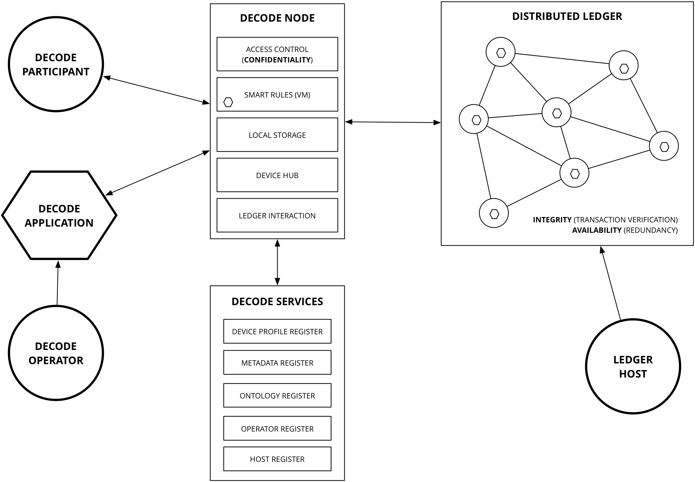

# Outline

This documents describes the design of the DECODE architecture.

DECODE is ...

WHY THIS WHITEPAPER: ...

This whitepaper is structured as follows. We first describe the functionality the architecture should implement, together with the main non-functional requirements (like security and privacy and ...). We then give a high-level description of the DECODE architecture, before digging deeper and discussing the main components and how they are implemented in detail.

This whitepaper will be updated regularly to include new functionality and improved designs. The current version describes the minimum viable product (MVP).

# Functionality

DECODE is a *platform*, running applications developed by third parties. Data can be shared (in a controlled and responsible manner) between these applications.

Main goals
- citizens manage access to their (personal) data
- citizens know who accessed their (personal) data
- applications can record transactions that are resilient and have verifiable integrity

The architecture must be secure and privacy friendly enough to host different sensitive applications in parallel.

*To be described based on 1-2 core use cases, e.g. collaborative economy/hospitality (FairBnB) and participatory citizen sensing (Things Network, Fitbit)*

3 exemplar use cases / demo apps:

- A) Citizen Sensing - Air quality for a location
- B) Asset sharing / renting (TBD, equivalent of FairBnB)
- C) Complex privacy (TBD, either in terms of participants or varying based on context)


# Architecture overview

We first describe the DECODE architecture at a very high level of abstraction. In the sections to follow we will discuss each of the components, and how they are implemented, in detail.

Entities
- users (citizens)
- governments (cities)
- businesses (SMEs)

Data[^data] is either *public* or *restricted*. (Some data is personal data, other data is not. The architecture cannot and does not distinguish that at the architecture layer.) Restricted data is *encrypted*. All data is stored on a p2p, high availability, redundant data store.

[^data]: Do we restrict the architecture to only mediate access to data? Or do we generalise to also mediate access to resources? (E.g. providing access to the Wifi router to the guests that have rented your house for a week?)

The *publisher* of restricted data determines who has access to the data. To this end it attaches an *entitlement condition* to the restricted data. Users wishing to obtain access to the data need to prove they possess the necessary *entitlement*. Entitlements can be *issued* to users. Entitlements have a *lifetime*: they are not valid before and not valid after a certain time. Additional flexibility can be expressed through *smart rules* that, given a set of inputs (consisting of entitlements but also other *context*, like the current location or the current time or date) yield an entitlement. Smart rules are stored and executed on a *distributed ledger*. Users store their entitlements privately.

(So, for example, a home owner wishing to allow his guests access to the local Wifi could create an entitlement `john-doe-house-wifi`, a smart rule saying "*if someone has an entitlement `renting-john-doe-house` and this entitlement is valid now, then output the entitlement `john-doe-house-wifi` valid for one hour*". Then if the owner rents out his house and issues the renter the entitlement `renting-john-doe-house`, access to the wifi is securely arranged automatically.)


Data sources[^datasources]:

- "Streaming" data from sensors
- open government data
- user generated content (blogs, recommendations, observations)
- ...

[^datasources]: Not sure whether we need the distinction, although streaming sensor data seems to be a
special kind of data that we need to reckon with. (JHH)



## Core Technical Values

- **Openness** of the platform, to enable innovation and citizen
participation.
- **Flexibility** through smart rules, driven by the needs of the usecases.
- **Transparency** and **auditability** of collective action and choice, privacy
of individual actions.
- **High-integrity**, appropriate **privacy** options, and **availability** against
disruption and suppression.
- **User-friendliness** for end-users, and app developers for **easy
adoption**.
- **Scalability** and **deployability** to compete with corporate and closed
platforms.


# Architecture Components - How does DECODE Work?


## The nodes

## The network

- p2p
- Identity?
- Relationship to the ledger? 

## Smart rules

- a language to express rules
- Riccardian contracts?


## Distributed ledger

The DECODE platform architecture has at its core a *distributed ledger* implementation. This provides the the capablities of availablilty and integrity. The core function of the ledger allows for distributed, redundant storage of objects and the verification of execution of smart rules. To be clear, the ledger in DECODE is not a distributed computing platform in the sense that for e.g. [Ethereum](https://ethereum.gitbooks.io/frontier-guide/content/contracts_and_transactions_intro.html) is, where the rules themseleves are executed within the distributed "virtual machine" in response to transactions which are submitted by participants.

In DECODE, smart rules are executed *outside* the ledger, and the results are submitted to the ledger for storage and verification. In this way, we allow for a completely private application to be written because the only requirement of the ledger is that it be *proovable* that an execution is correct, the ledger does not need to actually execute the transaction itself. For example one could write a smart rule that can be verified through the use of a [Zero Knowledge Proof](https://en.wikipedia.org/wiki/Zero-knowledge_proof).

This separation of *execution* from *verification* is a fundamental design principle of the ledger.

The ledger operates as a series of managed nodes running across the internet. The design of DECODE allows for multiple parties to operate networks of nodes. Further, when desiging a smart rule, the designer can select which node providers may execute the rule. Participants using the application and submitting transactions will have clear visibility of which organisations are participating in validating and accepting their transactions.

Where checks are required of multiple inputs and outputs to a transaction (e.g. to avoid a double spend scenario), all the input transactions will require to also be known to the validating network.


## Entitlements

### Declaration

Entitlements describe the access a subject has to some data item. They can be considered similar to descriptions of entitlements for example such as described by [Ladon](https://github.com/ory/ladon/blob/master/README.md#concepts).

Rather than attempting to build a hirearchical entitlements system by classifying certain attributes into privacy groups, such as "sensitive, personal, public" DECODE specifies all entitlements at the granularity of individual attributes.

For example, suppose that an entity with DECODE account ID#234 owns a data item which represents their personal profile:

```
{
    :schema "http://.../person"
    :attributes {
        :decode-id "#234"
        :first-name "Xxxxx"
        :last-name  "Xxxxx"
        :date-of-birth "YYYY-mm-dd"
        :passport-number "XXXXXXXXXXX"
        :gender "xxxx"
        :address {
            :number "0"
            :street "Xxxxxxxx xx"
            :town "Xxxxxx"
            :district "Xxxxx"
            :postal-code "xxxx"
            :country "XXX"
        }
    }
```
Person ID#234 wishes to grant a Consumer ID#567 access to some subset of thier data. ID#567 may be another individual or a DECODE application that is going to aggregate the data for some purpose.

DECODE defines three possible access levels:

| Access level    | Description        |
| --------------- | ------------------ |
| `invisible`     | Subject can see neither the existence of this attribute, or its value           |
| `can-discover`  | Subject can see that the data item has a value for this attribute, but not what it is |
| `can-read`      | Subject can both see that the data item has a value and read that value  |

In this example the consumer ID#567 is the subject and we can represent the entitlement as follows:

```
{:created 2016-03-30T20:24:34.412-00:00
 :valid [:from 2016-03-30T20:24:34.412-00:00 
         :to 2017-03-30T20:24:34.412-00:00]
 :subjects [#567]
 :schema http://.../person
 :owner #234
 :signature af4534faaacd34552344
 :access {
   :decode-id :can-read
   :first-name :invisible
   :last-name :can-read
   :date-of-birth :invisible
   :passport-number :can-discover
   :gender :invisible
   :address {
     :number :invisible
     :street :invisible
     :town :can-read
     :postal-code :invisible
     :country :can-read
   }}
} 
```

Notice that the entitlement has a specific time range that it is valid for. It also specifies specifically the list of subjects to which it applies, and the type of data. In this case the entitlement is to a **class** of data, it could also be to a specific data instance.

It indicates the entity which owns this data. It is also signed by the owner so that this entitlement can be verified.

Finally the granular access levels are declared for each specific attribute.

An entity may grant multiple entitlements to the same subject for the same data, but operating under different circumstances, for example, lets say the person in this case has agreed to book a room for rent - once the transaction has reached the point that the booking is confirmed, they are happy for the passport number to be revealed:

```
...
  :access {
  ...
    :passport-number :can-read
  ...
  }
...
  :conditions {
    :booking-status "confirmed"
  }
...
```

(Only the delta to the previous entitlement is shown).

In most cases, the participants in the system will not be creating the entitlements directly, they will be interacting with DECODE applications. These applications will have the ability to declare what entitlements they require and the participants can agree to them, in much the same way that users can accept authorisation grants using OAuth.


### Access control

Defining and declaring entitlements is a matter of describing access rules. In order for these to be useful we require a mechanism to enforce them. In a traditional system we would simply "trust" that the system has been coded to take account of the entitlement declaration - for example we might install an authorisation server product to define and store entitlements and rely on the developers of the system to code appropriate controls into the system that communicate with the authorisation server.

How does the DECODE platform provide for integrity and transparency around the privacy controls, as expressed in the entitlements?

What they are

- attribute based credentials
- attribute based encryption


## The user interface

# Conclusions

# QUESTIONS

*Put your questions or items for discussion here*

- Do we need to distinguish Hubs, OS and nodes? (The way I understand it is that the DECODE Hub is the physical thing that runs the DECODE OS, on top of which the DECODE Node is the main user-facing application that users use to manage their data and access to their data. Is this correct?)

- What is a "Node" - is it a hardware device that a participant owns or is it a server running on the internet?

- Recommendation systems (SOTA 5b) and privacy-preserving, discrimination aware data-mining (SOTA 6a): they are placed at the DECODE OS level in the proposal, but aren't these higher-level applications? Or is some kind of OS support necessary to achieve them?

- Do ALL interactions with decode need to go through the device?

- What about multiple people who are using the same device?

- Do people themselves need an "account" that is on the server side - perhaps like bitcoin based on a public key which is maintained within a HSM that they own? e.g. ubikey?

- Is there scope for interactions which might happen through a mobile device (e.g. IOS / Android) - perhaps a trust is constructed between the decode device and the mobile device? i.e. I could register my Iphone on the network?

- Is there a need to provide an "entitlement" to the metadata as well as the data itself ? In some cases privacy is compromised by the knowledge that the data exists.

- Do we need to make the distinction that citizens are both "data owners" and "data consumers"?

- Should we make it clear that the "data owner" should be the arbitrator who decides whether a piece of data is *public* or *restricted*?

Use of Distributed ledger technology

- What is the rationale that leads us to this conclusion - i.e. Based on a set of characteristics we are looking for, a distributed ledger fits

- What are the key constraints that might differ from either Bitcoin or Ethereum - i.e. Privacy, not everyone seeing the entire ledger?

Entitlements

- Internally at thingful we express entitlements very similar to AWS IAM Policies - The readme on this inspired project gives a very useful introduction -  https://github.com/ory/ladon#concepts (2-3 minutes read).

- I think entitlement expirations are a potential minefield if based on "wall clock" time especially in a distributed, possibly adverserial context. My first instinct is that we would need some oracle for time outwith of trusting the operating system and/or a singular NTP.


# DUMP

*Put things here that you think are relevant, but that are not clear enough yet, or for which it is not clear where to place them*


# FOR REFERENCE: Design requirements taken from the proposal

The following pieces of text appear in the proposal and are relevant with respect to both the scope of the architecture and how the architecture should be implemented.

Higher level aims:

- *Prevent the concentration of power in the hands of a few platform operators* that aggregate big data on a global scale through a fully decentralised architecture for identity management, data storage, processing and governance.
- *Represent and effectively use an extended range of data*, coming from people, sensors, devices and the city; deploying privacy-aware intelligent systems that help to make citizens more aware of issues and possible social solutions; fostering collective deliberation and bottom up decision-making.
- *Ensure that people are in full control of their data and identity*, maintaining privacy and trust in the systems they use, reaping the benefits of big data aggregation, within a clear socio-technical and legal framework, enhancing privacy and ownership of data.
- *Create a level playing field* enabling new entrants (social entrepreneurs, P2P developers, open source software and open hardware developers) to implement innovative approaches and applications, opening up new economic and social perspectives.
- *Preserve the digital sovereignty of European (and worldwide) citizens*, preventing unauthorised usage of their personal data, on clouds, social networks and the Internet of Things.

More concrete design goals:

- DECODE will develop a decentralised IoT data access system using open standards (for example, CoAP, MQTT, UPnP, etc.)  that accommodates legacy devices, smart objects and new services, enabled by controllable data sharing.  These will be embedded in a modern scalable blockchain, and supported by distributed smart rules, providing a fully decentralised social-application ecosystem.
- DECODE builds on a Free and Open Source Software (FOSS) and hardware platform.
- DECODE technology will provide a means to manage identities of parties as collections of personal attributes, access and influence in the domain of the body (BAN), local (LAN) and wide area network (WAN).  It will develop specific data-brokers based on the generic principles proposed for each network, backed by a state of the art blockchain infrastructure supporting smart rules and privacy protections.
- DECODE will develop an intuitive interface empowering citizens to control with the click of a button with whom they share their data, in which format (addressing interoperability), and who is allowed to perform actions at what times, up to the lowest possible granularity.  Specific policy language will be developed that is both easy to express smart rules in, and easy to audit for compliance and to build trust.
- DECODE will develop a decentralised system for accessing private IoT data and open civic data, creating a data index and data presentation interface, able to deliver secure, stable, validated datasets to a data entitlement layer in which citizens are in full control of these datasets.
- “MyData approach”: Let the citizen control who can access their personal data and under what circumstances, using adaptive, smart, context-dependent access rules. 
- Citizens will be able to amend incorrect data and delete unwarranted data.
- DECODE will define solutions and strategies for streaming, publish/subscribe access, storage  decentralisation and redundancy of real-time IoT data.
- Smart Rules facilitate data governance and identity management with basic functions: publish/subscribe access to events and functions to interface with external APIs; core functions to store and access the blockchain according to ABC entitlements; library functions to interfaces with external applications.  Smart rules allow users to define obligations around their data, and conditions of access.  Providers and app developers can also specify rules relating to the operation of the system or the regulatory environment.
- DECODE makes it possible for data subjects to determine access rights to their information through flexible entitlements (smart rules).
- DECODE develops a distributed and privacy-aware architecture for decentralised data governance that supports  the governance of decentralised data and federated identities. (a  fully  decentralised  architecture  for  identity  management,  data  storage,  processing and governance.)

## Fully distributed architecture for data management 

We plan on leveraging the existing social and community structure around the pilot applications, and design technically distributed stores with a decentralised authority.  Those should provide high% integrity, availability and confidentiality.  Both sybil%resistance to flooding attacks by corrupt nodes, and also routing security will leverage emergent trust assumptions, rather than expensive proof of work schemes. We aim to support complex transactions, since those are necessary for rich services and even simple local currencies and token / reservation systems to support Uber / Airbnb types of applications. At the same time, to challenge those systems, a serious volume of transactions needs to be supported (such as 1000s/second).  No such service, combining all those features, exists today.

## Scalable distributed ledgers

DECODE needs a distributed data backend offering high-integrity, high-availability, which is compatible with privacy techniques such as attribute-based credentials (ABC) and attribute based encryption (ABE). It should balance transparency and privacy.

## Decentralised identity management, privacy, and trust: Attribute-based credentials/encryption

DECODE will propose a novel ABC access model that is decentralised and where data, rules, and credentials may be stored on the distributed ledger.  Whenever they meet at a DECODE node, the rules determine whether (some of) the data is released.

DECODE projects aim at addressing the following challenges: how to securely issue and use credentials that are stored in the distributed ledger instead of at the user locally; how to exert control over distributed stored credentials; how to combine attribute-based encryption and attribute-based credentials; and how to authorise transactions anonymously using ABC.

## Formal language for the management of data access and privacy (smart rules) 
 
A language is needed to define, implement and enforce clear and transparent smart rules for data access, governance and identity management.  Access rules should allow organisation to use data, depending on specific parameters; capture and enforce legal rules and constraints, as well as rules around anonymisation obligations and data deletion or retention.  Language rules must be enforced by design, on either centralised or decentralised datasets.  Their enforcement should be safe from platform attacks (through hacking or malware).  Language design should promote clarity and avoid ambiguities; their syntax should be extended according to the need that will emerge.  The rules should ensure the respect of the decisions of the data owner (for example, citizen or the city), but also of collective regulations and legal obligations on application providers.

## Decentralised data access and open IoT semantic ontology

De-couple the search and access functions. A lightweight open source client with complete transparency can be installed by the data consumer service (app, algorithm, service etc.)  to search for data and once the results are returned, the Interchange client can borrow for each source its data repository parser maps, access credentials and other relevant information. Build a smart rule based interface to its service for device and data owners which links to a shared semantic ontology which will be external to core search and access service and which will be stored via a distributed data storage layer.  The smart rule interface (T3.5) will provide a mechanism for any interested party to provide new or amended taxonomic information, and the created taxonomy will have a permanent presence on the network meaning that it will exist beyond the control of any single party.

## Privacy-preserving, discrimination=aware data mining and recommendation system 

 In DECODE we will devise privacy%preserving data mining and aggregation methods that will extend the existing works in privacy-aware data mining by allowing efficient privacy analysis and anonymisation of distributed datasets, residing on the DECODE distributed ledgers. DECODE aims to develop non-discriminatory data mining methods that will extend the existing works in discrimination-aware data mining by allowing the discrimination analysis and prevention in the decentralised data analytics and recommendation systems, where data needed for data mining and personalisation might be distributed among different parties in the context of the data entitlement model.  While the current state of the art only focused on discrimination risks of classification data mining tasks in the centralised setting, our work also takes into account discrimination risks in recommendation systems and distributed datasets.
 
## Trust framework for digital commons, including personal data 

DECODE will transform the current data ecosystem so that individuals can truly own and control their data.  In order to do so, the conditions for the processing of data set out by the individual would constitute the basis for an organisation to accept to engage with and use the data.  This would not be exactly a privacy policy or a consent form, but a different kind of rule or license to use the data.  DECODE proposes a combination of business practices, legal rules and technical solutions (a trust framework) operated through smart rules that manage user preferences for data sharing and capture the “operating rules” for a community of trust.  This starts with transparency over what data is held by whom, and the ability to authorise any sharing while understanding the implications. Taking advantage of the potential of the distributed ledger technologies, DECODE will design legal schemes (rules and/or licenses) apt to foster stigmergic behaviours by individuals that generate digital commons made of personal data and identify the specific characteristics, ownership regimes, and access rights of such digital commons.

## Architecture Notes

###Values

These from Georges slide deck


###Components - What they are, what are their responsibilities

Data storage - in particular what do do with large volumes of streaming data, vs transactional data (e.g. I agree to lend someone my lawnmower for x times)

The Decode Stack - from Hardware -> OS -> Applications


