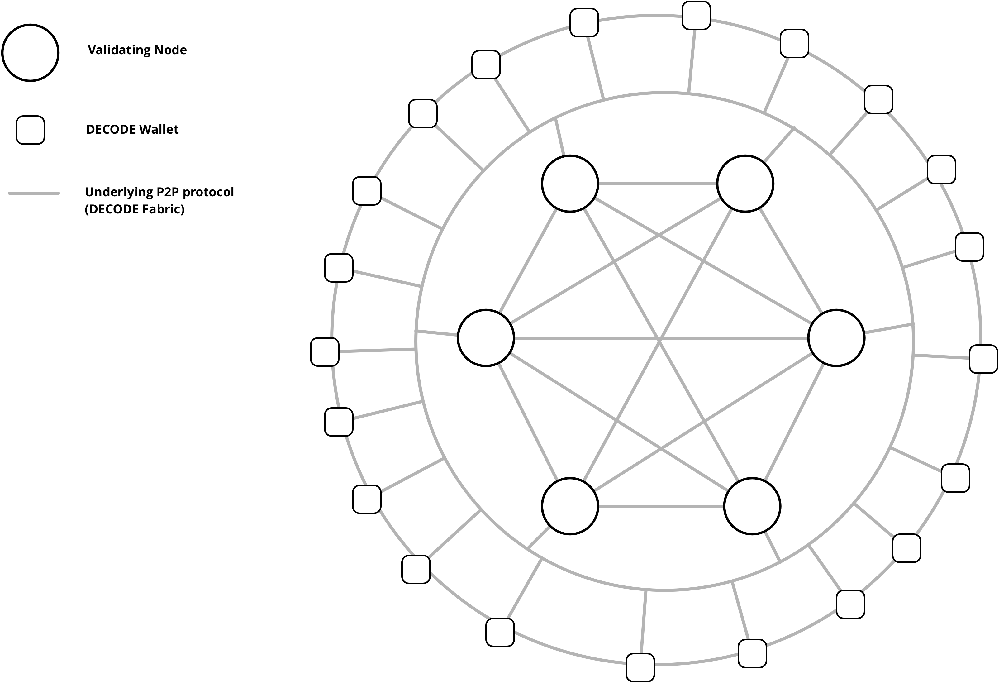
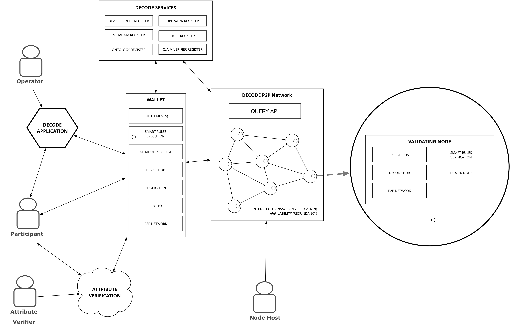

# DECODE Architecture

DECODE is at the core a distributed P2P network of "nodes" that together provide data privacy and integrity services to application developers.

The overall architecture is similar to other distributed ledgers and we have followed familiar terminology, such as "Wallet". We describe here the roles and responsibilities of each of the components and how they work together to achieve our goals.

## Data Storage

There are three significant *types* of data which are stored within the DECODE system:

1. Attributes
2. Ledger Transactions
3. IoT Data streams

**Attributes** are stored in the **Attribute Store**. In the simplest case the implementation is to store in encrypted form locally to the wallet. This will be the starting point for the implementation of DECODE. It is however possible that a **distributed storage** mechanism could be provided using a P2P protocol such as [IPFS](https://ipfs.io/). This capability would be exposed via the attribute store interface. The advantage of a distributed store are:

- Resilience / backup
- Access same data on multiple devices
- Wallet itself need not have storage capabilities (can act purely as a crypto engine / key manager)

A distributed store could take advantage of the existing P2P network of DECODE validating nodes or be formed of a separate network, either an existing network or one that is formed by DECODE participants.

**Ledger Transactions** will be stored in the ledger node system, dependant on the implementation of the ledger. Our privacy by design principles ensure that no *private* data will be stored on the ledger. It is possible that encrypted data could be stored on the ledger. 

**IOT Data streams** IOT data represents a special case of data in that it is likely to involve larger volumes of time series data. DECODE will continue to explore this space as it moves into implementation. A key question will be how to leverage existing IOT data stores / aggregators such as the [AWS IOT](https://aws.amazon.com/iot/). Following our principle of "Reuse don't Re-Invent", one option is to provide tools that allow decode to be integrated as an entitlements and access control mechanism over such existing aggregators and data stores. A more involved option is for DECODE to provide a custom store (based on open source stack such as [Cassandra](http://cassandra.apache.org/) or [Elastic Search](https://www.elastic.co/products/elasticsearch)). Elastic search for example already provides a mechanism for [Role Based Access Control (RBAC)](https://www.elastic.co/guide/en/shield/current/configuring-rbac.html) which may provide a starting point.

The theme of data storage will continue to evolve and will be published via the whitepaper.

## Validating Nodes

The integrity and resilience of the network is provided through a distributed network of Validating nodes. One of the key architectural features of DECODE is that it separates *execution* of logic (*contracts*) from the *verification* of that logic, which allows for privacy aware execution.

The validating nodes are key to providing the integrity and availability of the DECODE network. Therefore we build them from the ground up with a strong emphasis on verifiability by basing them on the DECODE OS. Each node will also contain the distributed ledger node and any other libraries and software that is required to participate in the DECODE network. This is likely to include cryptographic functionality and P2P networking capabilities to allow dynamic and evolving P2P networks to be formed. It is possible that the P2P networking capabilities can come from the underlying ledger implementation, or be augmented with custom protocols.

It is important to note that DECODE does not mandate that every participant host a validating node. The minimum software you need access to in order to participate is a DECODE Wallet. 

A key research question for DECODE is how to cover the cost of computation for these validating nodes? Who operates them? What are their motivations? The bottom line is that it incurs a cost to purchase hardware and consume electricity. For example, Ethereum has created a self sustaining network by offering a financial incentive to those nodes who execute the transactions, which is a straightforward economic model. 

DECODE seeks to explore alternative incentive models that do not involve direct financial reward and this will be an ongoing initiative for the project. It looks to models that work for the common good of citizens and will be exploring scenarios that move towards an "economy of the commons" as opposed to the centralised concentration of wealth within a few large organisations, which is the current dominant force in the data economy.

## Wallets

The wallet is the minimum component a person requires to interact with DECODE. Every **participant** will have their own wallet. The wallet has several core functions:

- Store securely cryptographic material (e.g. private keys)
- Securely store Attribute based credentials, linked to private keys
- Execute DECODE transactions (via Smart Rules) and submit them to the Ledger for verification
- Store, encrypted the participant's **attributes**
- Define and publish **entitlement policies** based on interactions with **applications**
- Provide the participant with a graphical user interface that allows them to manage their attributes, entitlements and applications. 

Optionally a participant can push the cryptographic functions of the wallet onto a hardware device, similar to Trezor, Ledger Nano from the blockchain world. A discussion of these options is to be found in the hardware section.

We have identified two options for participants to obtain a wallet and begin interacting with DECODE. This is a topic of research for the DECODE system and is likely to evolve as we move into field testing with real communities of participants.

### User Experience

The wallet will be one of the primary interfaces between DECODE and the participant, the other being the *applications* themselves. The wallet interface will be explored through a user centric design process which will aim to provide a state of the art experience for participants focused on transparency of who they have shared their data with. The Wallet will also be the point at which a particpant interacts with smart rules. 

**a) Download a Wallet**

The wallet will be available as a standalone application that a participant can download to their device (either laptop or mobile device). In combination with a hardware security device this will form the maximum level of protection that a participant can achieve. 

Whenever the participant must perform a cryptographically sensitive activity such as signing a transaction, they will be redirected to their wallet to perform this. 

**a) Wallets Hosted by Operators**

We recognise however that *requiring* participants to download software and engage with a registration process *may* be a barrier to adoption. We plan to explore this through user research and field experiments. With this in mind, the architecture of DECODE also supports the concept of an ***hosted wallet***. 

DECODE intends to provide tools and documentation to allow **operators**[^3rdpartywallet] to host wallets *on behalf* of their existing users. This is an  low barrier to entry for an operator, involving minimal integration whereby the operator maintains any existing authentication mechanisms they have in place and links existing accounts to a DECODE wallet. It also preserves any existing authentication structures the application may have, allowing DECODE functionality to be added in a decoupled and safe manner.

[^3rdpartywallet]: It might be possible for 3rd Parties to create an online wallet hosting service,  however we have yet to explore the demand for this scenario.

To maintain the core values of DECODE however, a constraint of this scenario is that the user *must be aware and consciously agree* to the connection between their account and DECODE. Whilst the process itself maybe "1 click" for the user, the user journey must include a "connect my account to DECODE" phase. The exact design guidelines for how this is achieved will be developed on an ongoing basis.

There is a tradeoff with this scenario in that while it allows for lower barrier to adoption, it also diminishes the true value of DECODE as a decentralised system. In this scenario, the trust relationship has not been decentralised, i.e. the participant is still trusting the operator as an organisation with all their data.

 

## The Ledger Implementation 

### Chainspace 

As part of the mission of DECODE, we present a distributed ledger implementation **Chainspace** ([http://chainspace.io](http://chainspace.io)) which has been designed deliberately with privacy and scalability in mind and is fully aligned to the goals and principles of DECODE. The full technical details of this implementation can be found within the chainspace whitepaper [@1708.03778].

In summary, chainspace provides a highly scalable, BFT fault tolerance ledger which separates transaction *execution* from *verification*. In implementation it provides for this in an entirely technology neutral and decoupled manner. 

**Chainspace contracts** can be written in any language and are composed of two asymmetric but cryptographically related  components. These are the *contract* and the *checker*. The *contract* is responsible for executing the transaction, definining the constraints that are required. The result of the execution of a *contract* is a *proof* which has no data from the transaction but which can be cryptographically verified by the  *checker*. The network of Chainspace nodes are responsible for verifying transactions and publishing the verifications as a blockchain. In implementation, Chainspace creates multiple blockchains, please see the chainspace whitepaper [@1708.03778] for more details.

### Alternatives

The architecture of DECODE, following the guiding principles of being modular and reusing code, is not restricted to the implementation of Chainspace to provide the underlying ledger capability. It is possible for example that with the cryptographic advances in Solidity already mentioned, that it would be possible to build DECODE using any ledger system that also incorporated the solidity vm, either Ethereum itself or for example the hyperledger [Burrow project](https://github.com/hyperledger/burrow) from [Monax](https://monax.io/).

As the project evolves alternatives will be explored and tested as they may solve for different tradeoffs, these will be documented in the public whitepaper. 

## Smart rules Engine

What we call "Smart Rules" in DECODE are a computable [@sober1978computability] sociolect [@louwerse2004semantic] that can be parsed into a semantic model referred to a finite ontology and executed by a distributed computing cluster. It is of central importance to grant participants the access to such a language and clear understanding of what it expresses and of the consequences of its execution.

The open nature of the smart rules is extremely important when compared to the popularization of "sharing economies" that apply mostly unknown rules that are opaque to the participants and undemocratically adjusted by third parties who are not participating in the economy, but in most cases just profiting from it.

The DECODE project plans the development of a language for "smart rules" that is not conceived to stay behind the scenes, but to be understood and modified: this a different approach to data management rather than CRUD-type interaction, an approach that is also necessitated by the distributed and write once immutable nature of blockchain technologies.

The underpinnings of the smart rules implementation are explained in-depth in the forthcoming deliverable D3.3 "Data Privacy and Smart Language requirements, its  initial set of smart rules and related ontology".

## Operating system architecture

The DECODE OS is the base operating system running all software designed, developed and deployed for the DECODE project. This operating system is based on the Devuan GNU+Linux distribution, a fork of the now 20 years old Debian distribution, maintained by the Dyne.org foundation and an open community of volunteers. Devuan forked Debian to preserve the simplicity and minimalism of the SystemV tradition in UNIX systems, still running modern software applications and inheriting the security patches from Debian.

The primary goal of the DECODE OS can be explained in brief by defining it as a "controlled execution environment" where, from the making of its base to the execution of every single application, all steps are recorded on a ledger of events that can be saved, analysed and shipped along with every instance of the operating system. A secondary goal of this development is that of making the results of such a recorded sequence of operations reproducible.

DECODE's implementation of a distributed computational system aims to be solid and fit for mission critical purposes by leveraging well established standard practices in the UNIX world. Contrary to the monolithic applications implementing blockchain functionalities in a single runtime environment running in application space, our implementation of a DECODE Node [@D1.1] is a controlled execution environment unit for Smart Rules grafted on the classic concept of a UNIX-like operating system, keeping POSIX.1b and SystemV compatibility.

The DECODE OS is explained in depth in the project deliverable "First Release of the DECODE OS" [@D4.4].

## Hardware Hubs

We use the term "Hub" to refer to any underlying compute infrastructure that can execute either the wallet software or a validating node. In this sense a hub can be any one of the following:

- Physical server or PC
- A virtual machine in a public or private cloud infrastructure (e.g. AWS, Google Cloud, Azure)
- A single board computer for e.g. [OLinuxXIno Lime](https://www.olimex.com/Products/OLinuXino/A10/A10-OLinuXino-LIME/open-source-hardware).
- A smart card running limited cryptographic code
- A mobile device such as a phone or tablet

This section provides a high level description of the requirements of the hardware, and a section specifically around the use of hardware for improving security.

In general, a participant who has more control over the full stack execution environment also has more control over the DECODE platform. Ultimately this is down to the hardware level and DECODE aims to provide details of how a participant or an operator can operate DECODE nodes that are entirely open source and auditable.

DECODE will support and explore a wide range of hardware software configurations, following the principle of being open and modular. This will allow participants to customise the level of security and control they adopt. There is a tradeoff between investment on the part of the participant to purchase and configure hardware devices vs the extra level of control and reduce need for trust of a third party. 

A key principle is that DECODE should not *mandate* the use of custom hardware by participants, in order to allow for greater adoption. It remains to be seen if participants "vote with their feet" and choose hardware devices, once DECODE is operational.

### Requirements

We list five key requirements of the hardware hubs here:

- Ability to run DECODE OS
- Transparency
- Deployability and availability
- Hardware security
- Connectivity

#### Ability to run DECODE OS

The processor of the HUB must be able to run the DECODE OS. To assure compatibility of a specific processor, it must be made a target of the DECODE OS SDK [@D4.1]. The DECODE OS SDK is modelled after the Devuan SDK and supports all its architecture targets. 

Additionally the following capabilities are required:

- Network connectivity (either wireless or ethernet)
- Processing power and memory to support:
    - cryptographic operations
    - embedded web server operations
    - execution of smart rules language
- Local storage in the initial phases at least enough to store attributes

The exact requirements of these will be determined as the project moves forward. Different configurations will have different requirements - for example there will be significantly more minimum compute power required for a validating node than just running a single wallet, which is should be possible to run on a mobile device.

#### Transparency 
One of the goals of the DECODE platform is to create a level playing field that enables developers from all backgrounds to contribute to society by implementing innovative applications and opening up new economical, technological and social values based on the new infrastructure that DECODE will provide. To facilitate the participation of these developers, all the elements of the DECODE architecture should be open source. For that reason any device specifically designed to operate as a DECODE HUB should be open source and compliant with the Open Source Hardware Association (OSHWA). Schematics, design files and documentation should be available for designers to build upon. DECODE will encourage hardware designers to join their efforts in creating a more secure and open hardware.  

#### Deployability and availability
Deployability is key to ensure the adoption and success of DECODE. Therefore, the HUB must be easily available. The most available potential HUB is any commercial computer. According to Barcelona data-sheet 20171 the Household ICT penetration is 88.3 in 2015 (% on population 16 to 74 years with a computer at home). Despite most of commercial computers not being open source this is a viable alternative for promoting an early adoption. For scenarios where an embedded device with a small form factor is required, low cost open source single board computers (SBCs) are a good alternative for the DECODE HUB. 

#### Hardware security
The need for privacy and confidentiality differ according to the use cases of the platform. For instance, noise quality data requires less security than biometric health-centered data that's being sent to a physician. This requires encryption on many different levels. To build trust in the platform, the DECODE hub needs to respond to the level of security for each separate use case.
Software-based security means that access conditions can be hacked and logs can be tampered with. In addition, the data itself cannot be considered secure if left unprotected on a regular PC.

For this reason the DECODE offers Participants the option to adopt hardware-based security when a higher level of confidentiality is required. The interaction with these security measures should be easy and effortless for the end-user.

Potential hardware security features for the HUB:

- **Multiple factor authentication:**
The security protection provided by a single authentication method, e.g. a password, have proved to be weak. To make access conditions 		more secure, the system can ask for a multiple factor authentication. This could be the combination of a password with some token that the user have (like an RFID or BLE device) or  biometric data like fingerprint readers or voice recognition.
- **Secure processors:**
Secure microcontrollers with built-in cryptographic engines and secure 	boot loader can guard against threats such as cryptanalysis intrusions, physical tampering, and reverse engineering. These secure microcontrollers are equipped with silicon-level anti-tampering features that allow to make them tamper resistant and to provide tamper evidence. The security keys, used to run cryptographic algorithms, need to be stored in a secure memory 	managed by a secure microcontroller and should only be accessible by the secure microcontroller and not from the outside of the 	memory.
- **Tamper avoidance:**
Anti-intrusion sensors can be incorporated into the electrical design to ensure someone tampering physically with the device would not have access 	to any sensitive data.
- **Side channel attacks protection:**
Side channel attacks consist in attacks based on information gained from the physical implementation of a system, rather than brute force or weaknesses in the algorithms. For example, timing information, power consumption, electromagnetic leaks or even sound can	provide an extra source of information, which can be exploited to break the system. The first step to protect against this types of threats is the reduction of the electromagnetic and sound radiations. Other measures include random calculations and delays introduced between normal operations and try to balance the power consumption of different data values.
- **Access	attempt detection:**
Any attempt to access the system data remotely is detected. If the 		access is illegitimate (unauthenticated, coming from an unknown IP address, etc.), access is denied and in some cases data can be erased.

#### Connectivity
Decentralized transactions will be continuously being carried by the NODE. This will result in the NODE using the network resources in an extensive manner. To reduce the latency in the communication and to avoid bandwidth bottlenecks, a high speed Ethernet port should be part of the specifications.

## Keys and smart cards

The DECODE architecture will provide an authentication method to interact with the system, as described, the main entry point will be via the Wallet.

Traditional authentication mechanisms consist in only one factor authentication like a pin code or password. But password based security has proven to be insufficient to prevent unauthorized access to websites, networks and hardware devices. For this reason, users are now requiring  multiple factor authentication, usually called 2FA for Two-factor authentication, 3FA for Three-factor authentication, etc. By combining several authentication factors, the authentication process is made more secure.
Authentication factors include:

- Knowledge factors: The users needs to prove knowledge of a secret that only themselves know. Typical secrets include passwords, PIN codes, answer to secret question etc.
- Possession factors: An object that the user owns is used as a key to access the system. Typically, objects used in authentication include passive or active tokens, smart card chips packaged in a variety of form factors (key, token, ring, badge, etc.).
- Inherent factors: something associated with the user, such as biometrics, are used as a key to access the system. Examples include fingerprint readers, retina scanners, voice recognition etc.

In order to make access more secure DECODE will optionally support hardware based authentication with login tokens that provides 2FA via the U2F standard. The login token can safeguard and manage digital keys for strong authentication and provide crypto processing. These modules traditionally come in the form of a plug-in card or an external device that can be attached directly to a DECODE HUB.

Open source examples for hardware security modules and login tokens:

**Authentication keys:**

- **Nitrokey:** Nitrokey is an USB key that enables high security encryption, signing of data and login to the Web, networks and computers. Both Hardware and software are Open Sourced. 
- **U2F zero:**U2F Zero is a USB key that works with all services that support U2F. It works for 2 factor authentication and sometimes password replacement. There is a button on the key that the users press to authenticate themselves.
- **FST-01 (Flying stone):** This is a small 32 bit computer that comes in the shape of a USB key

**Hardware secure modules:**

- **CrypTech Alpha:** "The CrypTech Alpha is an open source standalone prototype key-storage and hardware cryptography platform."
- **Pitchfork:** Project PITCHFORK is a small dedicated computer for handling your cryptographic operations and keys.

## IoT connectivity

A core use-case for the DECODE project is to provide a set of tools to enable personal IOT data to be securely managed.

Integrating with the plethora of IoT devices on the market is a non-trivial problem and one that the DECODE project considers solving by :

**Normalisation** Data from devices range from high level representations in JSON and XML to a series of bytes. Normalisation is the process of transforming into a common, open format. JSON-LD (https://json-ld.org/) is an example of one such format.

**Semantic Understanding** Once data is normalised it is important to understand the meaning of the data. To add this understanding you could use an ontology such as the M3-Lite (http://ontology.fiesta-iot.eu/ontologyDocs/m3-lite.owl#).

An example of a tool that provides this approach is the device-hub software offered by Thingful. The tool is available at [https://github.com/thingful/device-hub](https://github.com/thingful/device-hub)

