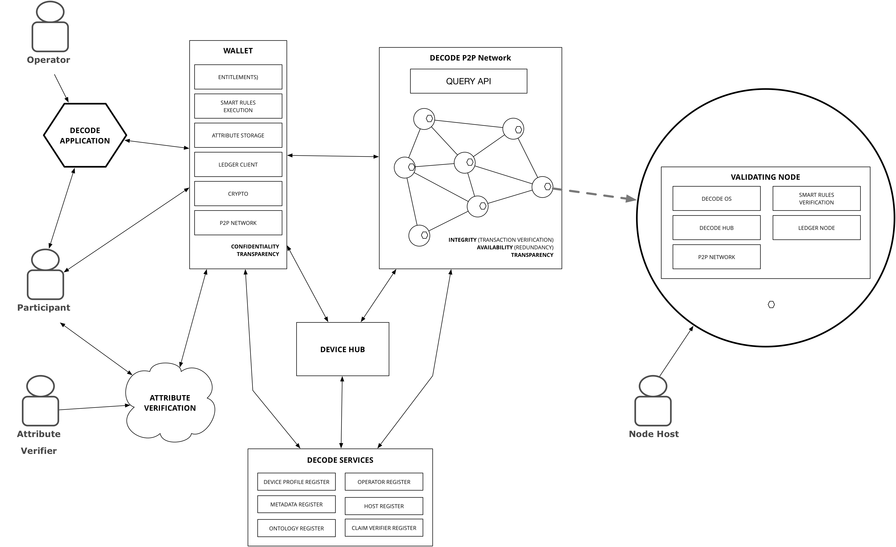

# DECODE Implementation




## Relay nodes (validating nodes)
- User Interface

## Wallet nodes

- User Interface

## Hardware Hubs
## Keys and smart cards
## IOT connectivity

```comment
Curator: MarkD
```
A core use-case for the DECODE project is to provide a set of tools to enable personal IOT data to be securely managed.

Integrating with the plethora of IOT devices on the market is a non-trivial problem and one that the DECODE project considers solving by :

**Normalisation** Data from devices range from high level representations in JSON and XML to a series of bytes. Normalisation is the process of transforming into a common, open format. JSON-LD (https://json-ld.org/) is an example of one such format.

**Semantic Understanding** Once data is normalised it is important to understand the meaning of the data. To add this understanding you could use an ontology such as the M3-Lite (http://ontology.fiesta-iot.eu/ontologyDocs/m3-lite.owl#).

An example of a tool that follows is the device-hub software offered by thingful. The tool is available at https://github.com/thingful/device-hub

## P2P networking

- p2p
- Identity?
- Relationship to the ledger? 


