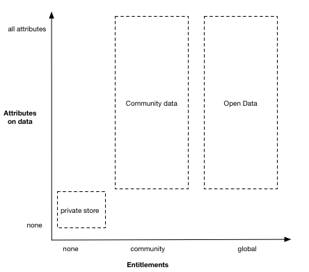

# Outline

This document describes the design of the DECODE ([https://decodeproject.eu/](https://decodeproject.eu/)) architecture. The document will evolve over time and will be published regularly as a versioned series.

| Version                        | Date Published            |
| ------------------------------ | ------------------------- |
| EA-SNAPSHOT | (Targeted Oct 31 2017)    |

The Whitepaper gives an overview of what DECODE is, why it is important and how it relates to the landscape of decentralised applications. It then reviews the conceptual foundations on which it is built and how they combine to achieve its purpose. It then describes at a high level the core components of the architecture and what role they play and finishes with illustrative examples of how it can be applied in the real world.

# Introduction to DECODE

## What is DECODE and why is it important?

DECODE (DEcentralised Citizen-owned Data Ecosystems) is an experimental project to enable practical alternatives to how we manage our personal data and interact on the internet. DECODE will develop technology that puts people in control of their personal data, giving them the ability to decide how it is shared.[@meandmydata] The current models of data sharing enable service providers to collect citizens' data in exchange for services. Given the high value of this data to service providers, a vast number of them appropriate data to create value without providing people with a comparable compensation.

DECODE  focuses  research  and  development  effort  on  novel  notions  of  trust  and  privacy that  can  be  operationalised  in  new  governance  frameworks,  and  innovative  economic  models  based  on  digital  commons. The digital commons are a form of commons involving the distribution and communal ownership of informational resources and technology [@digitalcommons]. Resources are typically designed to be used by the community by which they are created. In particular, the distinction between digital commons and other digital resources is that the community of people building them can intervene in the governing of their interaction processes and of their shared resources [@D1.8].

{width=300}

In DECODE, Entitlements attached to private data will be searchable in the public domain but will grant access only to  those  parties  that  have  the  entitlement  to  access  it.  This  novel  concept  of  data  rights  and  entitlements  also  applies to data being sent to or consumed by connected IoT objects in order to perform actions on the real world,  allowing citizens to manage and control their devices and the data they generate. [@DECODEProject]

DECODE enables participants to choose who they share their data with and what data is being shared with the recipient. The aim of DECODE is to provide state of the art tools to give people better control of their data on the internet. The project will contribute to enabling a free and open digital commons into which people can share their data in a secure and anonymous way. This will mean that all of society can benefit from the insights that can be gained from data. 

The project will develop and test a free, open source, distributed, privacy aware, and trusted technology architecture for decentralised data governance and identity management. [@D6.1]

### The goals of DECODE:

We identify the following key goals for DECODE:

- allow *participants* to manage access to their *private data*, by granting and revoke access through *entitlements*
- allow *operators* to write *smart rules* sign them and get the authorisation to run them on DECODE
- allow *smart rules* to access *private data* based on *entitlements* and matched *attributes*
- allow everyone to record *entitlements* on a *distributed ledger* whose integrity is resilient and verifiable

## History and current state of the art

Decentralised technology ecosystems have been around for decades, and more recently there has been an explosion of decentralised platforms powering the rise of cryptocurrencies. In 2008-09, Satoshi Nakamoto implemented the first decentralised currency combining advancements in public key cryptography with a consensus algorithm widely known as "proof of work". This was a breakthrough in building a completely decentralised ecosystem that was centred around the transfer of 'assets' from one individual to another. Since then, there have been several advancements in using blockchain for creating both fungible and non-fungible assets.

Ethereum [@EthereumWP] provides a blockchain implementation that can be used to encode arbitrary state transitions, enabling it to be used as a decentralised 'back-end' for applications. Ethereum takes the very specific distributed application of bitcoin and generalises it to provide a massively decentralised computing infrastructure. Nodes in the network execute decentralised applications via "Smart Contracts" and record the state transitions on a public blockchain. These smart contracts are executed through a computing virtual machine called the "Ethereum Virtual Machine" (EVM). 

Monax (published on the hyperledger project as Burrow) is an open platform for developers to build, ship, and run blockchain-based applications. It provides an abstraction over the underlying ledger techology and by default includes the [Tendermint](https://tendermint.com/) ledger engine and the ethereum vritual machine. Tendermint have also released a combination of these called [Ethermint](https://github.com/tendermint/ethermint) which effectively allows ethereum applications to run on tendermint. Public ledgers such as Ethereum are both anonymous and permissionless systems, i.e any user can run validating nodes, and the inherent nature of the cryptography that is the basis for mining determines that an attacker would need to control more than 50% of the network. The decentralised and distributed nature of the network combined with the cost of proof of work, forms the basis of its trust model.

Identity on the internet has evolved from being implemented as centralised silos to federated identity models. Federated identity enables single sign on available across several large service provider platforms. Service providers continue to be data controllers, in both centralised and federated models. Sovrin [@Sovrin] is a blockchain based identity platform, providing the user control, security, and portability.

DECODE is an evolution of the concept of decentralised systems which leverages state of the art cryptographic techniques such as [Distributed Ledgers](section-link) and [Attribute Based Credentials](section-link) to build a system that provides its [participants](glossary-link) the capability to store data securely, give control and transparency over with whom and for what purpose data is shared and transact with other participants or  organisations.

At a high level we can describe DECODE as being composed of the following:

- a set of specifications for distributed ledgers to support decode
- a free and open source reference implementation of a distributed ledger
- a smart rule language that can be translated and graphically represented
- a GNU/Linux based operating system that can execute signed smart rule applications
- the documentation needed for operators to write and deploy smart rules that request access to private data
- an intuitive graphical interface for participants to allow smart rules to access their private data
- an ontology of attributes for private data that is aggregated by operators
- an attribute based cryptographic implementation that can grant access to data
