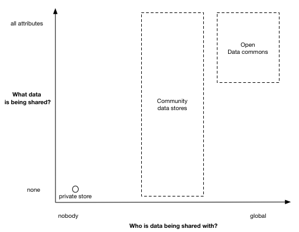

# Outline

This documents describes the design of the DECODE ([https://decodeproject.eu/](https://decodeproject.eu/)) architecture. The document will evolve over time and will be published regularly as a versioned series.

| Version                        | Date Published            |
| ------------------------------ | ------------------------- |
| EA-SNAPSHOT (Early Access)     | (Targeted Oct 31 2017)    |


The whitepaper is structured as follows. We first describe the functionality the architecture should implement, together with the main non-functional requirements. We then give a high-level description of the conceptual foundations that are brought together, before digging deeper and discussing the main components. We describe the function and responsibility of these and how they relate to each other. We then discuss what kind of applications can be built with DECODE and provide some examples.


# Introduction to DECODE

## What is DECODE and why is it important?

DECODE is a transdisciplinary effort involving different fields in technology, legal, business, and social sciences to provide digital tools for managing data online. The main premise of DECODE is to provide value for the  data subjects and citizens themselves rather than the service provider only. The current model relies on service providers collecting citizens' data in exchange for services. Given the high value of this data to the service provider, a vast number of them appropriate data to create value without providing people with comparable compensation.

DECODE aims to design and implement a free, open source, reliable and distributed architecture to run applications developed by third parties. The DECODE architecture must be secure, distributed and privacy friendly as it will host different privacy sensitive applications in parallel.

DECODE  focuses  research  and  development  effort  on  novel  notions  of  trust  and  privacy  (privacies)  that  can  be  operationalised  in  new  governance  frameworks,  and  innovative  economic  models  based  on  data  commons.  Entitlements attached to the private data would be searchable in the public domain but will grant access only to  those  parties  that  have  the  entitlement  to  access  it.  This  novel  concept  of  data  rights  and  entitlements  also  applies to data being sent to or consumed by connected IoT objects in order to perform actions on the real world,  allowing citizens to manage and control their devices and the data they generate. [Ref. DECODE proposal]



In its most granular format, the entitlements on data should enable users to choose who they share their data with and what data is being shared with the recipient. The aim of DECODE is to provide blockchain-based tools to give people better control of their data on the internet. The project will then create free and open data commons into which people can share their data in a secure and anonymous way. This will mean that all of society can benefit from the insights that can be gained from data. The project will develop and test a distributed, privacy aware, and trusted technology architecture for decentralised data governance and identity management. [Ref: D6.1 Dissemination Strategy and Communication Plan]

DECODE is an evolution of the concept of [decentralised systems](section-link) which leverages state of the art cryptographic techniques such as [Distributed Ledgers](section-link) and [Attribute Based Credentials](section-link) to build a system that provides its [participants](glossary-link) the capability to store data securely, give control and transparency over with whom and for what purpose data is shared and transact with other participants or  organisations.

DECODE aims to design and implement a free and open source, reliable and distributed architecture to run applications developed by third parties.

The DECODE architecture must be secure, distributed and privacy
friendly as it will host different privacy sensitive applications in
parallel.


### DECODE is made of:

- a set of specifications for distributed ledgers to support decode
- a free and open source reference implementation of a distributed ledger
- a smart rule language that can be translated and graphically represented
- a GNU/Linux based operating system that can execute signed smart rule applications
- the documentation needed for operators to write and deploy smart rules that request access to private data
- an intuitive graphical interface for participants to allow smart rules to access their private data
- an ontology of attributes for private data that is aggregated by operators
- an attribute based cryptographic implementation that can grant access to data


### DECODE main goals are:

- allow *participants* to manage access to their *private data*, by granting and revoke access to parts
- allow *operators* to write *smart rules* sign them and get the authorisation to run them on DECODE
- allow *smart rules* to access *private data* based on *entitlements* and matched *attributes*
- allow everyone to record *entitlements* on a *distributed ledger* whose integrity is resilient and verifiable

```comment
TODO: description of 1-2 use cases once the first pilot in Amsterdam and Barcelona are selected, e.g. collaborative economy/hospitality (FairBnB) and participatory citizen sensing (Things Network, Fitbit)*
```

3 exemplar use cases / demo apps:

- A) Citizen Sensing - Air quality for a location
- B) Asset sharing / renting (TBD, equivalent of FairBnB)
- C) Complex privacy (TBD, either in terms of participants or varying based on context)

## History and current state of the art

```
Bitcoin -> Ethereum
        -> Private implementations -> Alternatives to Proof of work
                                   -> Permissioned -> Hyperledger -> Monax Burrow
                                                                  -> IBM Fabric
                                                                  -> R3 Corda

Models Of execution:

Execute transactions vs Verification

Privacy

Scalability


```
